# mycomputer.bg v2 Architecture

This document is the single source of truth for future development of mycomputer.bg v2. It describes the current Laravel backend, Filament admin, Nuxt frontend, import/sync systems, public API, and planned search evolution.

## Phase 7.5 Catalog Sync Architecture Lock

Purpose: define the current supplier-to-catalog architecture and the safety limits that must be respected before Phase 8 UPDATE sync.

Phase 7.5 pauses feature development before Phase 8 UPDATE sync. The current supplier-to-catalog architecture is:

```text
Supplier XML/CSV
-> supplier_products staging
-> Catalog Sync Preview
-> pricing rules
-> exclusion rules
-> matching
-> sync_action preview
-> manual selected CREATE sync
-> catalog products
```

Current write capability:

- Manual selected CREATE sync is enabled for eligible selected rows only.
- Manual selected UPDATE price/stock sync is implemented for eligible selected rows only and is guarded by `CATALOG_SYNC_UPDATE_ENABLED`.
- Sync All is not enabled.
- Automatic sync is not enabled.
- Scheduled catalog sync is not enabled.
- Image import through sync is not enabled.
- CREATE diagnostics are read-only.

Allowed:

- Supplier import into `supplier_products` staging.
- Read-only preview and diagnostics.
- Manual selected CREATE sync for server-side validated eligible rows.
- Manual selected UPDATE sync for server-side validated eligible rows, limited to price, supplier cost, stock, availability, and supplier offer metadata.

Forbidden:

- UPDATE sync for content, images, categories, attributes, or media.
- Sync All.
- Automatic or scheduled catalog sync.
- Image import through sync.
- Direct supplier import writes to catalog products.

Important links:

- [Catalog Sync](CATALOG_SYNC.md)
- [Supplier Import](SUPPLIER_IMPORT.md)
- [Data Ownership](DATA_OWNERSHIP.md)
- [Content Locks](CONTENT_LOCKS.md)
- [Pricing Rules](PRICING_RULES.md)
- [Supplier Exclusions](SUPPLIER_EXCLUSIONS.md)
- [Matching Rules](MATCHING_RULES.md)
- [Sync Safety](SYNC_SAFETY.md)
- [Rollback Plan](ROLLBACK_PLAN.md)
- [Roadmap](ROADMAP.md)
- [Phases](PHASES.md)

Supplier import and staging are separate from catalog products. Supplier import writes to `supplier_products`; catalog products change only through controlled Catalog Sync paths. Preview is the control layer before writes.

## APCOM Local Semantics Review Boundary

The Phase 9C.6.5C.3A APCOM source-to-staging reconciler is an architecture
review surface, not a new import path. It reads an explicitly supplied local
XML source and existing `supplier_products` staging, validates a frozen
baseline, and emits aggregates and bounded hashes only. It does not enter the
supplier import or Catalog Sync write paths and does not alter route ownership,
queues, schedules, public APIs, products, taxonomy, attributes, or media.

The official APCOM profile is non-persistent and review-only. Its semantics
never grant automatic import, reconciliation, matching, content overwrite, or
Catalog Sync authority. See [APCOM Official Field Semantics And Read-only Reconciliation](APCOM_OFFICIAL_FIELD_SEMANTICS_RECONCILIATION.md).

APCOM staging diagnostics on VPS recently scanned `1859` supplier products and found `0` CREATE candidates. Most rows were matched, excluded, already linked, or had no meaningful changes. Unmatched rows do not automatically become CREATE candidates, and name similarity remains diagnostic/warning only.

Phase 8 UPDATE sync uses a narrow allowlist: price, supplier cost, stock/quantity, availability, and active supplier offer. It must not update name, slug, descriptions, SEO, images, categories, or attributes without separate design and approval.

Future work / open questions:

- Phase 8 manual selected UPDATE design.
- Audit log and rollback implementation.
- Feature flags and kill switches for broader sync operations.
- Separate ownership designs for images, categories, and attributes.

## System Overview

mycomputer.bg v2 is a modular e-commerce platform for computer hardware, laptops, components, monitors, printers and accessories.

Core principles:

- Laravel owns business logic, persistence, imports, checkout, shipping and payment workflows.
- Filament is the internal operational admin panel.
- Nuxt is the public storefront and consumes only `/api/v1`.
- Supplier XML/CSV imports never update public products directly.
- Product Sync is the controlled bridge from supplier staging data into catalog products.
- Public API never exposes supplier internals, raw feeds, import payloads, `purchase_price`, credentials or admin-only data.
- B2B quotes are staged as quote requests first; accepted offers become normal orders and then flow into ERP sync.

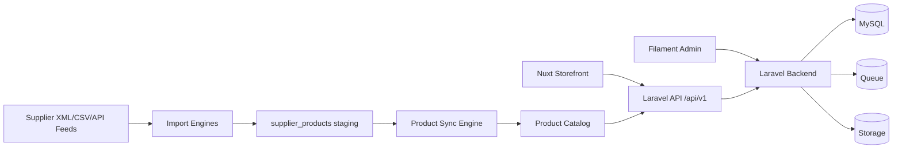

## Laravel Backend Architecture

The backend is a Laravel 12 application organized around domain modules rather than a single monolithic catalog controller.

Main backend responsibilities:

- Catalog persistence and relationships.
- Supplier feed ingestion and staging.
- Product synchronization from staged supplier data.
- CSV import/export workflows.
- Public API for Nuxt.
- Cart, checkout, orders, customers.
- Shipping provider abstraction.
- Payment provider abstraction.
- Authentication, account management, roles and permissions.
- Queue jobs and scheduled syncs.

Key conventions:

- Models live in `app/Models`.
- Public API controllers live in `app/Http/Controllers/Api/V1`.
- API resources live in `app/Http/Resources`.
- Form requests live in `app/Http/Requests/Api/V1`.
- Business logic lives in service classes under `app/Services`.
- Background work lives in `app/Jobs`.
- Filament resources live in `app/Filament/Resources`.

## Supplier Import Scheduling Architecture

Scheduled supplier imports are coordinated by `SupplierImportScheduleService`, `SupplierImportOrchestrator` and `SupplierImportSafetyService`.

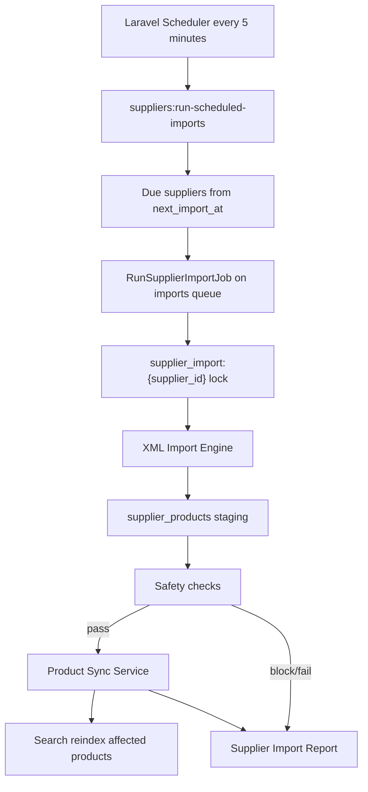

Supplier imports never write catalog products directly. XML and CSV feeds are staged into `supplier_products`, then Product Sync updates catalog records after safety checks pass. Future API supplier imports must follow the same staging-first rule.

Operational tables:

- `supplier_import_runs`: run status, trigger type, metrics, warnings, errors and generated report data.
- `suppliers`: schedule and safety configuration such as `schedule_type`, `next_import_at`, `minimum_product_count`, `maximum_product_drop_percent` and `allow_destructive_sync`.

Safety rules block empty feeds, very small feeds and mass product-count drops. Redis/cache locks prevent overlapping runs per supplier. Filament exposes import history, dashboards, manual import and force import actions.

## Filament Admin Architecture

## B2B Portal Architecture

The B2B module prepares company accounts, company user roles and quote requests without implementing a complex negotiated pricing engine yet.

Main tables:

- `b2b_companies`
- `b2b_company_users`
- `quote_requests`
- `quote_request_items`
- `quote_request_messages`
- `quote_request_files`

Main services:

- `B2BCompanyService`: company application, approval and user-company lookup.
- `QuoteRequestService`: quote creation, submit, offer, accept, file/message handling and quote-to-order conversion.
- `QuoteNumberService`: unique quote number generation.

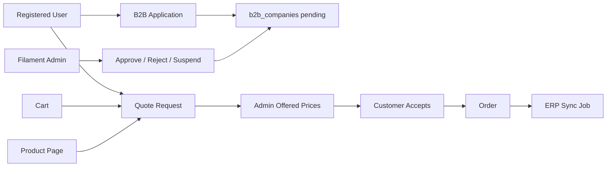

### Quote Request Flow

Quotes can originate from product pages, carts, the B2B portal or admin. Customer-created requests may include requested prices, quantities, notes and files, but only admins can set offered prices. Internal admin notes are stored separately and are not returned by account quote APIs.

### Quote To Order Conversion

Accepted quote offers create normal `orders` and `order_items` using offered prices. Orders receive `b2b_company_id` and `quote_request_id` when available. After conversion, the existing ERP layer receives a pending order sync job. No real ERP quote document sync is implemented yet.

### ERP Integration Notes

The B2B module currently integrates with ERP only at order conversion time by creating an ERP order sync job. Future ERP quote document sync should be added through the existing provider abstraction, not directly from controllers.

### B2B Pricing Future Path

Future B2B pricing should add a dedicated pricing service that can evaluate company contracts, ERP price lists, quantity tiers and negotiated discounts. Public product prices and quote offered prices should remain separate to avoid accidental catalog price changes.

## Warranty, RMA And Service Portal Architecture

The service portal owns post-purchase support workflows for warranty claims, service requests, returns, DOA cases and replacement requests.

Core tables:

- `service_tickets`: workflow state, order/product links, warranty dates, assignment, diagnosis, repair and refund data.
- `service_ticket_files`: private customer/admin uploads for photos, PDFs, invoices and warranty cards.
- `service_ticket_messages`: customer/admin communication plus internal notes that are hidden from customer APIs.

Core services:

- `ServiceTicketService`: creates tickets, validates purchased products, calculates warranty expiry, stores files, adds messages, updates workflow state and emits integrations.
- `ServiceTicketNumberService`: generates unique `SRV-*` ticket numbers.

Integrations:

- Orders and products are used to pre-fill purchase date and warranty period.
- B2B company ownership allows company users to track company service tickets.
- ERP sync jobs are staged for `service_ticket_created`, `service_ticket_closed`, `replacement_issued` and `refund_issued`.
- Email automation queues ticket lifecycle templates.
- Marketing analytics records ticket and resolution events.

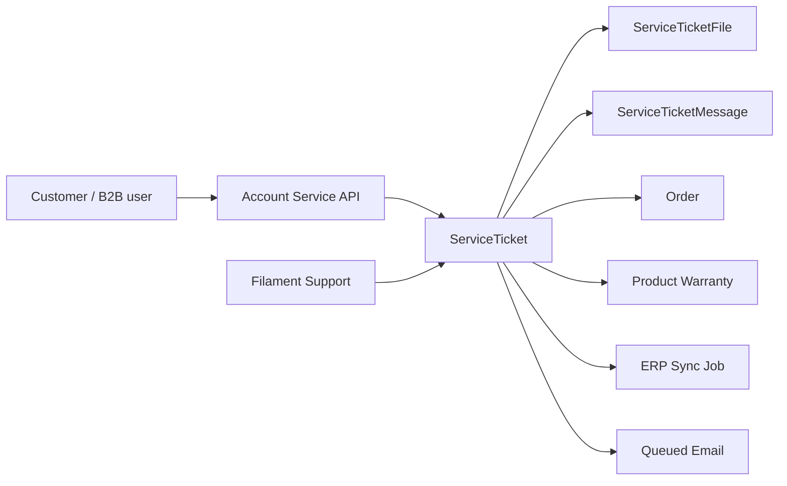

Filament is the operational back office. It is not used by the public storefront.

Admin areas:

- Catalog: categories, brands, products, images, attributes.
- Suppliers: suppliers, feeds, supplier products.
- XML imports: mapping templates, import jobs, histories, failures.
- Product sync: sync logs and dashboard stats.
- CSV center: import jobs and export jobs.
- Sales: customers and orders.
- Shipping: providers, methods, offices, shipments.
- Payments: providers, methods, transactions.
- Access Control: users, roles and permissions.

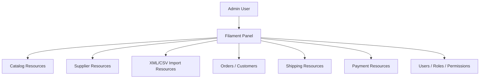

Filament actions are used for operational commands:

- Queue XML imports.
- Preview XML imports.
- Sync supplier products.
- Queue CSV imports/exports.
- Sync courier offices.
- Create shipment placeholders.
- Change order, payment and shipping statuses.

## Product Catalog Architecture

The product catalog is the public commerce source used by the Nuxt storefront.

Main entities:

- `categories`
- `brands`
- `products`
- `product_images`
- `attribute_groups`
- `product_attributes`
- `attribute_values`
- `product_attribute_values`
- product relation pivots for related and accessory products

Product rules:

- `ProductWorkflowService` is the authoritative, transactional state machine for manual product review and publication.
- Manual Filament products start as `draft`, inactive, and non-public; approval and publication are separate actions.
- Generic product CSV creation also starts as a manual, inactive draft and cannot inherit the legacy published database default.
- Workflow state, public-state fields, actor IDs, and timestamps cannot be changed through normal product form payloads.
- Product form writes are server-allowlisted by role domain: content, pricing, stock/availability, and SEO permissions remain separate.
- Public products must be `active = true`, `workflow_status = published`, `product_status = active`, and have `published_at` and a slug.
- Public products must belong to an active category and must not be soft-deleted.
- Product APIs, search hydration and indexing eligibility, homepage sections, relations, sitemaps, and feeds use the central `published()` boundary.
- Hiding a published product returns it to `approved`, removes public visibility, and preserves publication history.
- Restoring a deleted product never republishes it automatically.
- API responses must not expose `purchase_price`.
- API responses must not expose `source_payload`.
- API responses must not expose supplier internals.

See [Product Workflow](PRODUCT_WORKFLOW.md) for the transition and role matrices. Quality flags and missing English content remain non-blocking. Supplier imports and Catalog Sync do not use the manual Filament form and cannot overwrite managed product content.

Product relationships:

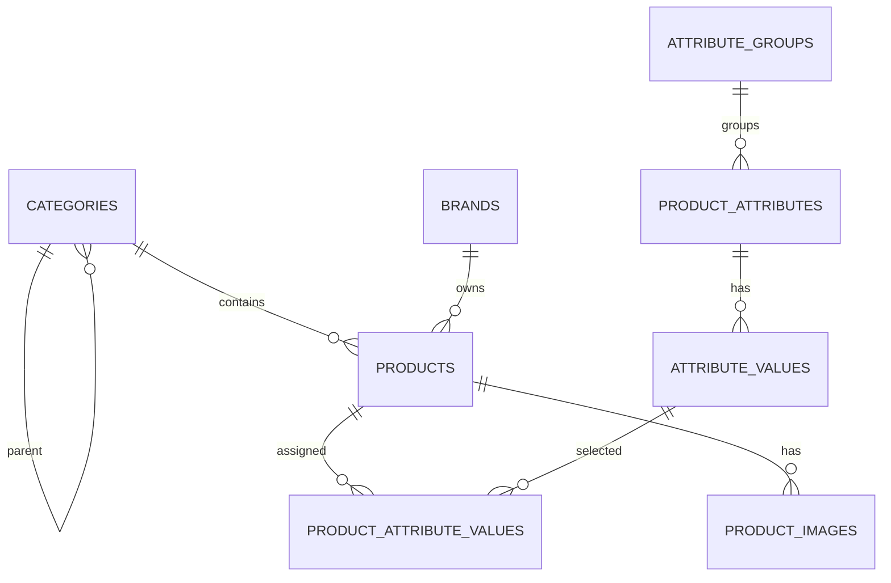

Phase 9C.1 adds the internal Product Attributes foundation for catalog-owned specifications. Phase 9C.2 improves the admin usability and adds the manual dry-run/apply starter attribute command. See [Product Attributes](PRODUCT_ATTRIBUTES.md). Supplier attribute mapping, automatic attribute sync and storefront attribute filters remain future controlled phases.

## Product Bundles Architecture

Product bundles are catalog-adjacent sellable packages. They never replace `products`; instead they group active products and convert into normal order component lines for inventory tracking while preserving a separate bundle sales record.

Main entities:

- `product_bundles`: bundle metadata, status, type, pricing strategy, SEO and scheduling.
- `product_bundle_items`: fixed bundle components or required configurable component groups.
- `product_bundle_options`: selectable products for configurable component groups.
- `cart_bundle_items`: selected bundle lines stored on a cart.
- `order_bundle_items`: purchased bundle snapshot stored on an order.

Supported bundle types:

- `fixed_bundle`
- `configurable_bundle`
- `frequently_bought_together`
- `starter_pack`
- `accessory_pack`

Service boundaries:

- `BundleService`: public active bundle queries.
- `BundlePricingService`: fixed, sum, percentage and fixed discount pricing.
- `BundleInventoryService`: availability and stock validation.
- `BundleCartService`: add/update/remove cart bundle lines and convert them to order records.
- `BundleRecommendationService`: bundles related to a product.

Checkout behavior:

1. Cart subtotal includes regular cart items and bundle lines.
2. Stock validation checks bundle component products.
3. Checkout creates one `order_bundle_items` row per purchased bundle.
4. Checkout also creates zero-priced `order_items` component rows for inventory and fulfillment visibility.
5. Stock is reduced for regular products and bundle component products.
6. Products are never deleted automatically because of bundle changes.

Promotion and analytics behavior:

- Promotion rules can target `bundle_id`, `bundle_type`, `bundle_contains_product` and `bundle_contains_brand`.
- Bundle pricing savings are calculated before cart-level promotions.
- Marketing events currently log `bundle_added_to_cart` and `bundle_purchased`.

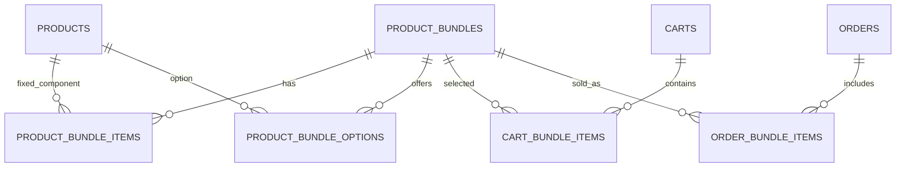

## ERP Integration Layer Architecture

The ERP integration layer is a provider-based synchronization boundary for external ERP systems. The web application does not implement ERP accounting, fiscal or warehouse rules internally; it creates normalized sync jobs and delegates provider-specific behavior to `ErpProviderInterface`.

Main entities:

- `erp_providers`: provider configuration, status, encrypted credentials and settings.
- `erp_sync_jobs`: push/pull sync logs for orders, customers, invoices, payments, products and stock.
- `erp_documents`: invoice, receipt, credit note and stock document metadata.
- `erp_product_mappings`: product-to-ERP SKU/product mappings.
- `erp_customer_mappings`: customer/user-to-ERP mappings.

Provider classes:

- `ManualErpProvider`: records manual pending work and performs no external calls.
- `MockErpProvider`: deterministic success provider used for tests and staging validation.
- `MicroinvestProvider`, `ErpNetProvider`, `BusinessNavigatorProvider`: placeholders that fail loudly until implemented.

Queue jobs use the `erp` queue:

- `SyncOrderToErpJob`
- `SyncCustomerToErpJob`
- `CreateErpInvoiceJob`
- `SyncPaymentToErpJob`
- `PullStockFromErpJob`

Events:

- `OrderCreated` creates an order sync job. If an active provider exists, the order sync job is queued.
- `OrderPaymentStatusChanged` creates a payment sync job. If an active provider exists, the payment sync job is queued.
- `OrderCancelled` creates a cancellation sync log for manual/provider processing.

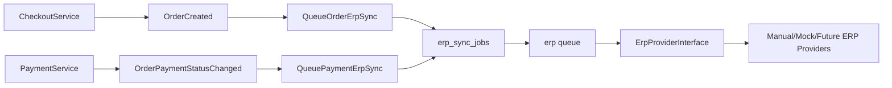

Security rules:

- ERP credentials are encrypted at rest through Eloquent encrypted casts.
- ERP credentials are never returned by public or admin API responses.
- ERP APIs are admin-only and permission-protected.
- Sync payloads are masked for sensitive key names before being stored.

## Supplier Module Architecture

The supplier module stores supplier configuration and raw supplier product data.

Main entities:

- `suppliers`
- `supplier_feeds`
- `supplier_products`
- `product_supplier_offers`

Important rule:

Supplier imports do not update catalog products directly. They write to `supplier_products` first.

Supplier products are staging records:

- raw supplier SKU/EAN/MPN/name/brand/category/price/quantity
- raw feed data
- mapping notes
- sync status
- product match reference after sync

This preserves history and makes future mapping, enrichment and auditing possible.

## XML Engine Architecture

The XML engine supports multiple supplier XML structures through mapping templates.

Main entities:

- `xml_mapping_templates`
- `import_jobs`
- `import_histories`
- `failed_imports`
- `supplier_products`

Main classes:

- `XmlImportEngine`
- `ProcessXmlSupplierFeed`
- `SyncDueSupplierFeeds`

XML flow:

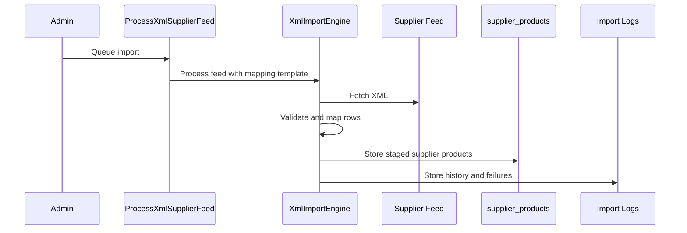

XML import guarantees:

- Supports mapping templates.
- Stores raw data.
- Logs failures.
- Supports preview.
- Does not write directly to `products`.

## Product Sync Architecture

Product Sync is the controlled bridge from supplier staging records to catalog products.

Main classes:

- `ProductSyncService`
- `SyncProductJob`

Main entities:

- `supplier_products`
- `products`
- `product_supplier_offers`
- `product_sync_logs`

Sync matching:

- SKU
- EAN
- MPN

Sync strategies:

- lowest price
- preferred supplier
- supplier priority

Product Sync flow:

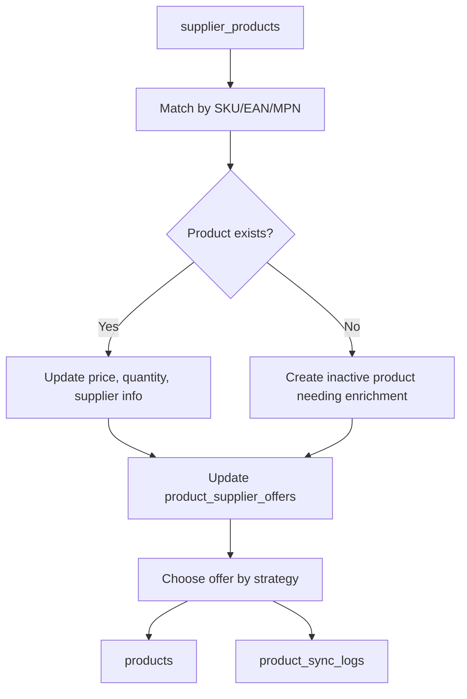

Rules:

- Never delete products automatically.
- Keep sync history.
- Detect duplicates and conflicts.
- Prepare for AI enrichment, category mapping and brand mapping.

## Product Attribute Normalization Architecture

The attribute normalization layer prevents duplicate catalog specifications and filters when multiple suppliers use different names or units for the same data.

Main entities:

- `canonical_attributes`
- `attribute_aliases`
- `canonical_attribute_values`
- `attribute_value_aliases`
- `supplier_product_attributes`
- `attribute_mapping_logs`
- `category_attribute_templates`

Main services:

- `AttributeNormalizationService`
- `AttributeNameMapper`
- `AttributeValueNormalizer`
- `UnitConversionService`
- `SupplierAttributeExtractionService`
- `AttributeMappingReviewService`
- `DuplicateAttributeDetectionService`
- `CatalogAttributeWriter`

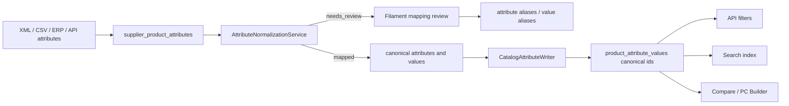

Rules:

- Raw supplier attributes are staged before catalog writes.
- Low-confidence rows remain `needs_review` and do not create public filters.
- Admin-approved mappings may create supplier-specific or generic aliases.
- Public APIs use canonical attribute codes and canonical value slugs when available.
- Legacy `product_attributes` remain as a compatibility layer for older catalog data.

Examples:

- `RAM`, `Memory` and `Оперативна памет` map to canonical `ram`.
- `16GB`, `16 GB` and `16384 MB` map to canonical value `16 GB`.

See `docs/attribute-normalization.md` for operational workflow details.

## CSV Import/Export Architecture

The CSV center provides structured import/export workflows for operational catalog management.

Main entities:

- `csv_import_jobs`
- `csv_import_failures`
- `csv_export_jobs`
- `csv_mapping_presets`

Main services:

- `CsvImportService`
- `CsvExportService`
- `CsvMappingService`
- `CsvValidationService`

Main jobs:

- `ProcessCsvImportJob`
- `ProcessCsvExportJob`

CSV import supports:

- products
- prices
- stock
- categories
- brands
- attributes

Modes:

- update-only
- create-only
- create-or-update
- dry-run

CSV export supports:

- products
- prices
- stock
- categories
- brands
- attributes
- products without images
- products without descriptions
- active products
- inactive products

CSV flow:

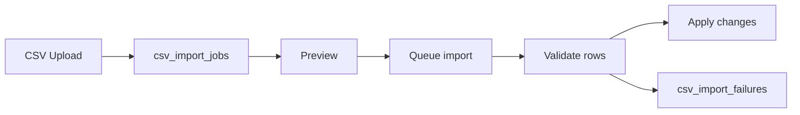

CSV attribute imports use the normalization engine. Mapped attributes are written to catalog assignments; unmapped or low-confidence attributes remain staged for review and are recorded as failed CSV rows so they do not pollute filters.

## Authentication Architecture

Authentication uses Laravel Sanctum for bearer-token API access from the Nuxt storefront.

Supported identities:

- guest users
- registered customers
- B2B customers
- support staff
- managers
- administrators

Main entities:

- `users`
- `personal_access_tokens`
- `user_profiles`
- `customer_addresses`
- `roles`
- `permissions`

User profile fields:

- first name and last name
- phone
- company and VAT number
- active flag
- last login timestamp
- avatar, birthday, newsletter preference and JSON preferences

Account API:

- registration and login return a Sanctum token
- logout revokes API tokens
- inactive users cannot log in
- password reset uses Laravel's password broker and one-time reset tokens
- password changes revoke API tokens
- account order history is restricted to orders matching the authenticated user email
- Filament admin password-reset UI and emails are Bulgarian and branded for COMPUTER2U. Request responses are neutral to prevent account enumeration; only active, non-deleted staff with panel access receive a reset notification.
- Admin/back-office/staff passwords require at least 10 characters, mixed case, a number and a symbol when a new password is set.
- Staff password rules apply to users who can access the Filament admin panel; customer storefront password rules are separate and unchanged.

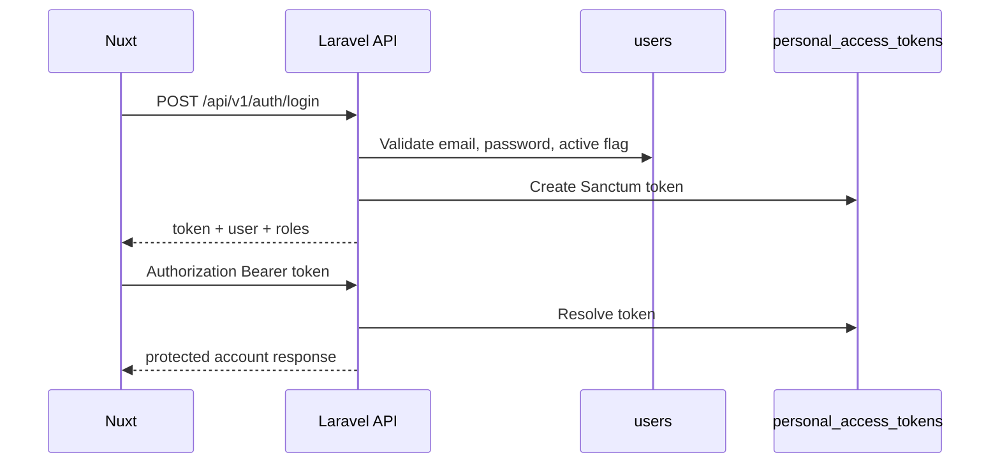

## Roles & Permissions Architecture

Authorization uses Spatie Laravel Permission.

Default roles:

- `admin`
- `manager`
- `support`
- `customer`
- `b2b_customer`

Default permissions:

- Catalog: `manage products`, `manage categories`, `manage brands`
- Orders: `view orders`, `manage orders`, `refund orders`
- Customers: `view customers`, `manage customers`
- Suppliers: `manage suppliers`, `manage feeds`
- Imports: `manage imports`
- Content: `manage blog`, `manage pages`
- System: `manage settings`, `manage users`, `manage roles`

Role model:

- `admin` receives every permission.
- `manager` receives operational catalog, order, customer, supplier, import and content permissions.
- `support` receives order/customer support permissions.
- `customer` and `b2b_customer` are storefront roles with no admin permissions by default.

Filament access:

- `User::canAccessPanel()` allows active users with `admin`, `manager` or `support`.
- Filament resources exist for users, roles and permissions.
- Users can be activated/deactivated and assigned roles from the admin panel.
- Super Admins can send password reset links to active users; plaintext passwords are not displayed, emailed or logged.
- Major Filament resources enforce Spatie permissions through resource authorization.
- Laravel policies map catalog, order, customer, supplier, import, user and role models to their matching permissions.

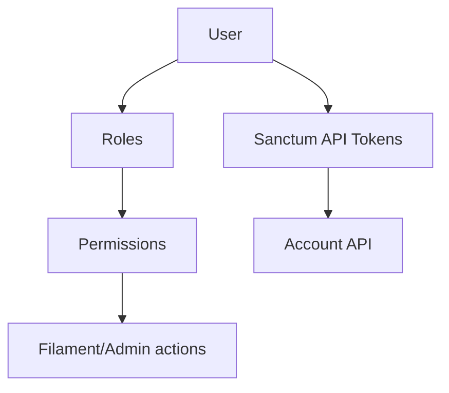

## Authentication Hardening

Current hardening rules:

- Guest checkout remains supported.
- Authenticated checkout stores `orders.user_id`.
- Account order history uses `user_id` ownership first.
- Historical guest orders can still be shown by email fallback only when `orders.user_id` is null.
- Filament access requires an active staff role.
- Filament resources for catalog, orders, customers, suppliers, imports, users and roles are permission-gated.
- Admin users cannot delete or deactivate themselves.
- The last active admin cannot be deleted or deactivated.
- Default roles cannot be deleted from Filament.
- Password reset links use Laravel's broker token table, expiration and one-time-use semantics.
- Admin password-reset links point to the Filament admin reset route and use the COMPUTER2U Bulgarian notification. Invalid or expired links return a generic Bulgarian error without exposing broker details, tokens, or account state.
- New admin/back-office/staff passwords must meet the staff password rule, but existing passwords and sessions are not invalidated.
- Inactive and soft-deleted users cannot request usable reset links or reset passwords.
- Password changes and password resets revoke API tokens.
- Inactive users cannot log in.

Order ownership:

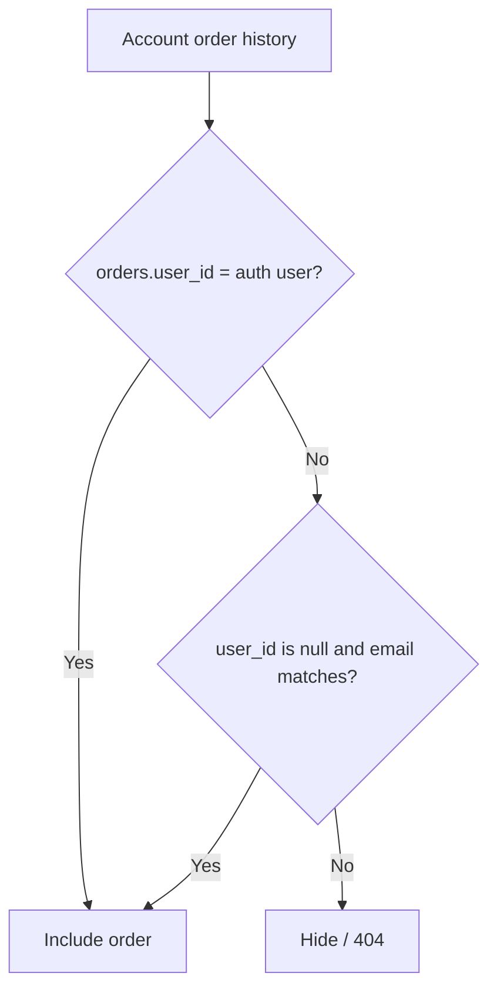

## Wishlist And Persistent Compare Architecture

Wishlist and compare are account-adjacent storefront modules. They are intentionally separate from cart and checkout so saved product intent does not mutate inventory, pricing or orders.

Wishlist:

- Stored in `wishlists` and `wishlist_items`.
- Owned by `users.id`.
- Registered users get a default wishlist on first account wishlist access or toggle.
- Users can create multiple wishlists.
- Guest wishlists are not persisted by the Laravel API.
- `wishlist_items.product_id` is nullable on product deletion, so historical list rows do not break rendering.
- Public responses return product cards only for active and published products.

Persistent compare:

- Stored in `product_compare_lists` and `product_compare_items`.
- Authenticated lists are owned by `user_id`.
- Guest lists are owned by `session_id` from the `X-Compare-Session` header.
- The Nuxt compare store persists the guest session ID in browser storage.
- On login, `POST /api/v1/compare/merge` moves guest compare products into the authenticated user's list.
- Compare lists are capped at 4 products by `CompareService::MAX_PRODUCTS`.
- Existing `POST /api/v1/compare` remains stateless and compatible for direct comparison requests.

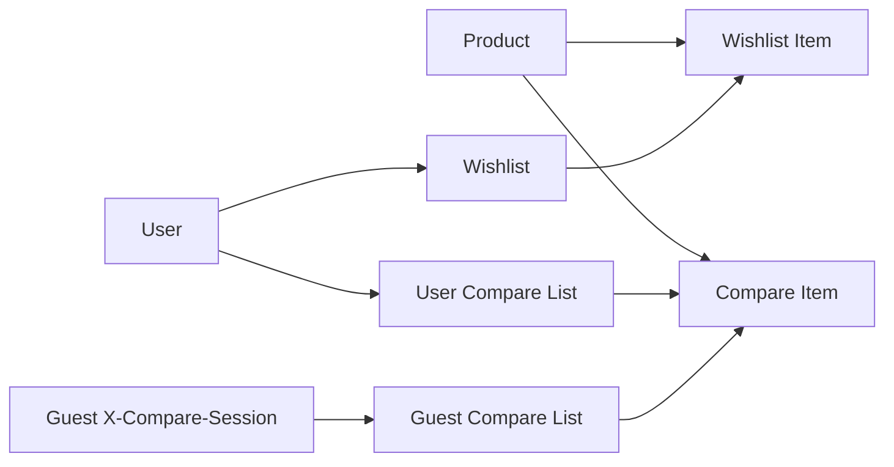

Guest compare merge flow:

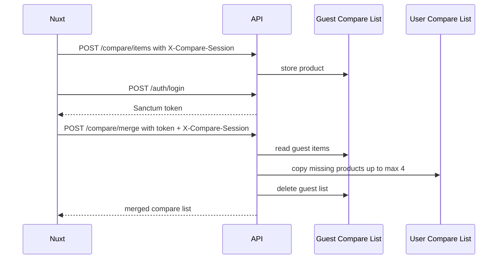

## Product Reviews Architecture

Product reviews are moderated user-generated content.

Data model:

- `product_reviews`: review body, rating, moderation status, verified purchase flag and soft delete.
- `product_review_votes`: helpful/not helpful feedback by user or guest session.
- `product_review_reports`: abuse reports for moderation.

Public display:

- Only `approved` reviews are returned by public endpoints.
- Product card and detail resources expose aggregate rating data from approved reviews only.
- Customer emails are never exposed in public API resources.
- Pending, rejected and spam reviews remain internal/admin/account-only.

Moderation workflow:

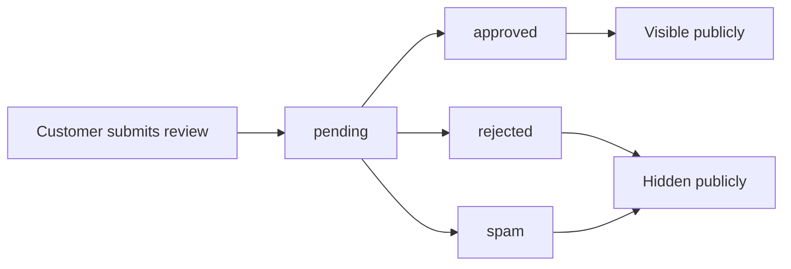

Verified purchase detection:

- `ProductReviewService` checks completed or shipped orders.
- Authenticated users match by `orders.user_id` first, with historical guest fallback by email when needed.
- Guest reviews match by submitted email.
- The order must contain the reviewed product in `order_items`.

Rating aggregation:

- `ReviewStatsService` calculates average rating, total approved reviews, verified review count and 1-5 rating distribution.
- Aggregates intentionally ignore pending/rejected/spam reviews.
- Product JSON-LD includes aggregate rating only when approved review count is greater than zero.

## Blog And SEO Content Architecture

The content system owns editorial and SEO content outside the product catalog.

Blog:

- `blog_categories` supports nested active categories.
- `blog_posts` supports draft, scheduled, published and archived states.
- `blog_tags` and `blog_post_tag` provide tag filtering.
- Blog posts support related products, categories and brands through pivot tables.
- `ReadingTimeService` auto-calculates reading time when posts are saved.
- Public API returns only published posts where `published_at <= now()`.
- Detail views increment `views_count`.

SEO landing pages:

- `seo_pages` stores landing pages, buying guides, category guides, brand guides, comparison guides and service pages.
- Pages can point to a primary related category and brand.
- Pages can also attach multiple related products, categories and brands.
- `schema_data` stores JSON-LD-ready structured data.
- Seeded examples include Bulgarian landing pages such as "Лаптопи за студенти", "Лаптопи за AutoCAD" and "Принтери за офис".

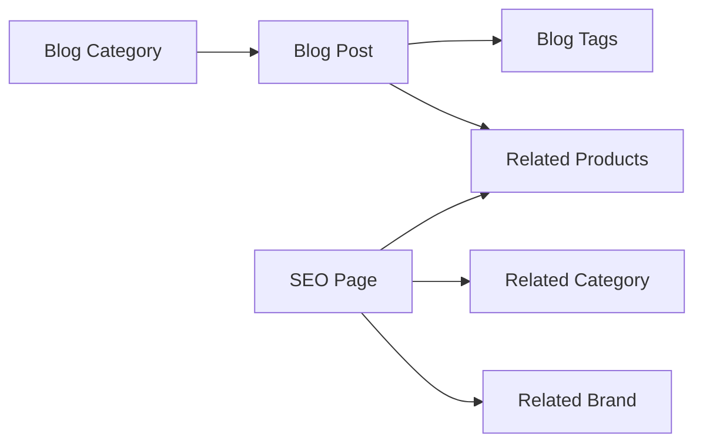

Sitemap architecture:

- `SitemapService` builds XML from public products, active categories, active brands, published blog posts and published SEO pages.
- Sitemap is available at both `/sitemap.xml` and `/api/v1/sitemap.xml`.
- Robots output references the web sitemap URL.

Responsive CMS Builder:

- SEO pages support legacy rich HTML content and JSON CMS blocks in the same `seo_pages.content` column.
- JSON block content is stored as `{ "blocks": [...] }`; each block contains `type`, `data` and per-device `responsive` settings.
- Supported device profiles are desktop `1200px+`, tablet `768px-1199px` and mobile `<768px`.
- `App\Support\Content\ResponsiveBlockDefaults` normalizes block payloads before API output, filling missing desktop/tablet/mobile defaults.
- Every block can define per-device visibility, width, max width, columns, spacing, alignment, typography, button behavior, padding, margin, height, carousel slides and media ordering.
- Hero/banner style blocks support `desktop_image`, `tablet_image` and `mobile_image`; fallback order is mobile to tablet to desktop.
- Filament `SeoPageResource` exposes a CMS Builder with Desktop, Tablet and Mobile preview/configuration tabs per block.
- Nuxt `SeoPageContent` renders block arrays mobile-first and keeps legacy string content rendering through prose HTML.

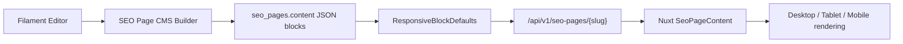

Content Blocks CMS Builder:

- `content_pages`, `content_blocks`, `content_templates` and `reusable_content_blocks` extend the responsive builder beyond SEO pages.
- `ContentPage` supports homepage, landing page, campaign page, brand page, category page, SEO page, B2B page, service page and custom page types.
- `ContentBlock` stores content, settings, responsive settings, visibility rules, active windows and sort order per page.
- `ReusableContentBlock` allows shared blocks to be reused and locally overridden.
- `ContentTemplate` stores starter layouts for campaigns, homepages, brand/category pages and B2B pages.
- `BlockRegistry` is the source of truth for supported block types across layout, marketing, commerce, bundles, categories, brands, trust, B2B, tech-store and editorial content.
- `BlockRenderer` merges reusable block data, applies `ResponsiveBlockDefaults`, resolves mobile/tablet/desktop images and returns Nuxt-ready payloads.
- `BlockRenderer` sanitizes CMS HTML output through `CmsHtmlSanitizer` for `rich_text`, `image_text` and `custom_html` blocks.
- Blocks hidden on all device profiles are removed from API payloads before frontend rendering.
- `BlockDataResolver` attaches public catalog data for product, category, brand and bundle blocks without exposing internal fields.
- Public endpoints are `/api/v1/content/homepage`, `/api/v1/content/pages/{slug}`, `/api/v1/content/templates` and `/api/v1/content/block-types`.
- Nuxt renders public CMS pages at `/content/{slug}` while `/pages/{slug}` remains backward-compatible with legacy SEO pages.
- Visible FAQ blocks produce schema.org `FAQPage` JSON-LD payloads in the content page API response.
- Filament resources are protected by `manage content pages`, `publish content pages`, `manage templates` and `manage reusable blocks`.

```mermaid
flowchart LR
    ContentEditor["Content Editor"] --> ContentPage["ContentPage"]
    ContentPage --> ContentBlock["ContentBlock"]
    ReusableBlock["ReusableContentBlock"] --> ContentBlock
    ContentTemplate["ContentTemplate"] --> ContentPage
    ContentBlock --> BlockRenderer["BlockRenderer"]
    BlockRenderer --> ResponsiveDefaults["ResponsiveBlockDefaults"]
    BlockRenderer --> DataResolver["BlockDataResolver"]
    DataResolver --> ContentApi["Content API"]
    ContentApi --> NuxtRenderer["Nuxt ContentBlockRenderer"]
```

Redirect architecture:

- `redirects` stores source URL, target URL, status code and active flag.
- Web fallback checks redirects before returning 404.
- `RedirectService` blocks protocol-relative targets and external hosts outside `mycomputer.bg`.

## AI Assistant Architecture

The AI Product Assistant is provider-agnostic. Business logic depends only on `AiProviderInterface`.

Providers:

- `MockAiProvider`: current template/mock implementation.
- `OpenAiProvider`: placeholder for future OpenAI integration.
- `AzureOpenAiProvider`: placeholder for future Azure OpenAI integration.
- `LocalLlmProvider`: placeholder for future local model integration.

Core services:

- `AiAssistantService`: stores conversations and orchestrates chat context.
- `ProductRecommendationService`: parses user intent and searches the public catalog.
- `ProductAlternativeService`: returns cheaper, better and similar alternatives.
- `ProductComparisonService`: reuses the existing compare engine and asks the provider for explanation.
- `BuyingGuideService`: returns template/provider buying guidance.

Data model:

- `ai_conversations`: user or guest session conversation.
- `ai_messages`: user, assistant and system messages.
- `ai_recommendation_logs`: recommendation result audit trail.

```mermaid
flowchart LR
    API["AI API"] --> Assistant["AiAssistantService"]
    API --> Recommend["ProductRecommendationService"]
    API --> Alternatives["ProductAlternativeService"]
    API --> Compare["ProductComparisonService"]
    Assistant --> Provider["AiProviderInterface"]
    Recommend --> Provider
    Compare --> Provider
    Provider --> Mock["MockAiProvider"]
    Provider -.future.-> OpenAI["OpenAiProvider"]
    Provider -.future.-> Azure["AzureOpenAiProvider"]
    Provider -.future.-> Local["LocalLlmProvider"]
    Recommend --> Catalog["Public Product Catalog"]
```

Security:

- AI endpoints are rate limited.
- Guest continuity uses `X-AI-Session`; authenticated history uses `user_id`.
- Public AI responses use product API resources and do not expose purchase prices, supplier data or raw payloads.
- Admin visibility is limited through `manage settings`.

Future OpenAI integration steps:

1. Implement `OpenAiProvider` methods using official SDK or HTTP client.
2. Add config keys for model, base URL, timeout and API key.
3. Keep prompt construction inside provider/adapters, not controllers.
4. Keep output normalized to existing array contracts.
5. Switch the container binding from `MockAiProvider` to `OpenAiProvider` through configuration.

## API Architecture

The public API is versioned under `/api/v1` and is designed for Nuxt SSR consumption.

API areas:

- navigation
- categories
- brands
- products
- search
- filters
- homepage
- compare
- SEO
- health
- auth
- account
- cart
- checkout
- wishlist
- persistent compare
- blog
- SEO pages
- redirects
- sitemap
- AI assistant
- shipping
- payments

API conventions:

- Use API resources for responses.
- Use form requests for validation.
- Use pagination for product lists.
- Limit `per_page` to max 100.
- Use eager loading to avoid N+1 queries.
- Cache navigation, homepage and category filters.
- Invalidate API cache when products, categories or brands change.

Security rules:

- Do not expose `purchase_price`.
- Do not expose supplier internals.
- Do not expose credentials.
- Do not expose raw XML/CSV/payment/shipping responses publicly.
- Do not trust frontend totals.
- Recalculate cart, shipping and payment amounts server-side.

## Nuxt Frontend Architecture

The frontend lives in `/frontend`.

Stack:

- Nuxt 4
- Vue 3
- TypeScript
- Tailwind CSS
- Pinia
- Nuxt Image
- SSR enabled

Frontend structure:

- `app/pages`: route pages
- `app/components`: layout, catalog, product, cart, checkout, UI components
- `app/composables`: API wrappers and SEO helpers
- `app/stores`: cart, compare and UI state
- `app/types`: API TypeScript contracts

Frontend API dependency:

```env
NUXT_PUBLIC_API_BASE_URL=http://localhost:8000/api/v1
```

Nuxt responsibilities:

- Render public storefront.
- Fetch data from `/api/v1`.
- Set SEO meta tags and JSON-LD.
- Maintain local cart fallback.
- Sync cart/checkout with backend when API is available.

### Multilingual Storefront Foundation

Bulgarian (`bg`) is the default and fallback locale. English (`en`) is an
optional secondary locale using Nuxt's `prefix_except_default` strategy:
Bulgarian URLs remain unprefixed, while Nuxt generates `/en`, `/en/catalog`,
`/en/categories`, `/en/c/{slug}`, and `/en/p/{slug}`.

The shared language switcher uses Nuxt locale routes rather than hard-coded
domains. The public API client sends the current locale as `X-Locale`; Laravel
resolves that header first, then `Accept-Language`, then the legacy validated
`?locale=` API option, and otherwise falls back to Bulgarian. API resources
keep their legacy fields and expose optional localized payloads. Storefront
components use those localized display fields when present and safely fall back
to the primary Bulgarian catalog content when English content is absent.

This is a read-only presentation foundation. It does not create translations,
change stored catalog content, alter API write behavior, or localize Filament.
Nginx explicitly routes only the approved English storefront paths to Nuxt:
`/en`, `/en/catalog`, `/en/categories`, `/en/c/*`, and `/en/p/*`. It does not
use a broad `/en/*` proxy, so localized admin, API, account, cart, checkout,
and other commerce paths remain outside this storefront routing scope. English
pages are `noindex, follow` by default;
alternate English hreflang links require the explicit
`NUXT_PUBLIC_ENGLISH_LOCALE_INDEXABLE=true` review gate. Existing Laravel
ownership of `/admin`, `/api/*`, `/livewire/*`, `/vendor/*`, `/build/*`, and
`/storage/*` remains unchanged.

Locale-dependent API responses include `Content-Language` and vary by
`X-Locale` and `Accept-Language`, while preserving any existing `Vary` values.
The deployment uses a same-origin Nuxt API base (`/api/v1`), so the locale
request header does not require a cross-origin CORS exception. Catalog content
may fall back to Bulgarian when English content is absent, and supplier data
cannot overwrite catalog-managed localized fields.

```mermaid
flowchart TD
    Pages["Nuxt Pages"] --> Composables["API Composables"]
    Composables --> API["Laravel /api/v1"]
    Pages --> Stores["Pinia Stores"]
    Pages --> Components["UI Components"]
    Components --> Stores
```

## Search Architecture

Current implementation:

- Product search is routed through `App\Services\Search\Contracts\SearchServiceInterface`.
- `MeilisearchSearchService` is the configured implementation and uses Laravel Scout when `SCOUT_DRIVER=meilisearch`.
- `DatabaseSearchService` remains the local/test fallback and is used automatically when Meilisearch is not configured or unavailable.
- Public controllers depend on `SearchServiceInterface`, never directly on Meilisearch.
- Search returns products, separate product bundle results, totals, page, per-page, categories, brands, suggestions, available filters and engine metadata.

Implemented interface:

```php
interface SearchServiceInterface
{
    public function search(array $criteria): array;

    public function suggestions(string $query): array;

    public function categoryFilters(string $slug): array;

    public function indexedProductsCount(): int;

    public function status(): array;

    public function reindex(): int;

    public function flush(): void;
}
```

Implementations:

- `DatabaseSearchService`
- `MeilisearchSearchService`
- future `OpenSearchSearchService`

Search flow:

```mermaid
flowchart LR
    Nuxt["Nuxt Storefront"] --> SearchAPI["GET /api/v1/search"]
    Nuxt --> SuggestAPI["GET /api/v1/search/suggestions"]
    Nuxt --> FilterAPI["GET /api/v1/filters/categories/{slug}"]
    SearchAPI --> Interface["SearchServiceInterface"]
    SuggestAPI --> Interface
    FilterAPI --> Interface
    Interface --> Meili["MeilisearchSearchService"]
    Meili --> Scout["Laravel Scout"]
    Scout --> MeiliServer["Meilisearch"]
    Meili --> Fallback["DatabaseSearchService fallback"]
```

## Meilisearch Implementation

Meilisearch is the primary catalog search engine because it is fast, typo tolerant and well suited for e-commerce faceted search.

Packages:

- `laravel/scout`
- `meilisearch/meilisearch-php`

Configuration:

- `config/scout.php`
- `.env`: `SCOUT_DRIVER`, `SCOUT_QUEUE`, `MEILISEARCH_HOST`, `MEILISEARCH_KEY`

Commands:

```bash
php artisan search:reindex
php artisan search:flush
```

Indexed models:

- `Product` in the `products` index
- `ProductBundle` in the `product_bundles` index

Indexed product document:

- product id
- name
- slug
- sku
- ean
- mpn
- brand
- category
- category path
- short description
- description
- price
- promo price
- stock status
- active
- featured
- new product
- bestseller
- attributes
- searchable keywords

Indexed bundle document:

- bundle id
- name
- slug
- description
- short description
- type
- pricing type
- fixed price
- discount value
- active/searchable state
- included product names
- included product SKUs
- included brand names

Never index:

- purchase price
- supplier credentials
- raw XML/CSV data
- `source_payload`
- internal notes
- supplier operational data

Filterable fields:

- category
- brand
- stock status
- price
- featured
- bestseller
- new product
- filterable attributes

Search quality targets:

- `lenovo loq`
- `rtx 5070`
- `gaming laptop`
- `laptop za autocad`
- `laptop do 2500`
- `hp printer`
- common typo correction such as `lenowo`, `asuss`, `samzung`

Admin:

- `SearchManagementPage` shows engine status, indexed product count and last indexing date.
- Admins can run reindex and flush actions from Filament.

Index lifecycle:

```mermaid
sequenceDiagram
    participant Admin
    participant Command as search:reindex
    participant Product as Product::toSearchableArray
    participant Bundle as ProductBundle::toSearchableArray
    participant Scout
    participant Meili as Meilisearch

    Admin->>Command: Start reindex
    Command->>Product: Chunk published products
    Product->>Product: Build safe searchable payload
    Product->>Scout: Queue searchable documents
    Scout->>Meili: Update products index
    Command->>Bundle: Chunk active bundles
    Bundle->>Bundle: Build safe searchable payload
    Bundle->>Scout: Queue searchable documents
    Scout->>Meili: Update product_bundles index
```

## Future Migration Path To OpenSearch

OpenSearch should be considered if the catalog requires:

- more advanced ranking control
- high-volume analytics
- complex aggregations
- distributed search clusters
- log/search unification

Migration path:

1. Keep the `/api/v1/search`, `/api/v1/search/suggestions` and `/api/v1/filters/categories/{slug}` response contracts stable.
2. Create `OpenSearchSearchService` implementing `SearchServiceInterface`.
3. Reuse `Product::toSearchableArray()` as the canonical product search document or extract it into a DTO if OpenSearch-specific analyzers require it.
4. Map current Meilisearch filter names to equivalent OpenSearch keyword/numeric fields.
5. Implement OpenSearch aggregations for brands, stock, price range and filterable attributes.
6. Add `SEARCH_ENGINE=opensearch` or equivalent service binding configuration.
7. Run a parallel index build and compare API responses before switching traffic.

The public API contract should not change when switching search engines.

## Database Overview

Major groups:

- Core Laravel: users, cache, jobs
- Auth: personal access tokens, user profiles, customer addresses, roles, permissions
- Catalog: categories, brands, products, images, attributes
- Suppliers: suppliers, feeds, supplier products, supplier offers
- XML: mapping templates, import jobs, histories, failures
- CSV: import jobs, export jobs, failures, presets
- Sales: carts, cart items, customers, orders, order items
- Shipping: providers, methods, offices, order shipments
- Payments: providers, methods, transactions

```mermaid
erDiagram
    PRODUCTS ||--o{ CART_ITEMS : added
    CARTS ||--o{ CART_ITEMS : contains
    CUSTOMERS ||--o{ ORDERS : places
    ORDERS ||--o{ ORDER_ITEMS : contains
    ORDERS ||--o{ ORDER_SHIPMENTS : ships
    ORDERS ||--o{ PAYMENT_TRANSACTIONS : paid_by
    SHIPPING_PROVIDERS ||--o{ SHIPPING_METHODS : offers
    SHIPPING_PROVIDERS ||--o{ SHIPPING_OFFICES : has
    PAYMENT_PROVIDERS ||--o{ PAYMENT_METHODS : offers
```

## Queue Architecture

Queues are used for potentially long-running work:

- XML supplier feed processing
- CSV imports
- CSV exports
- product sync jobs

Current jobs:

- `ProcessXmlSupplierFeed`
- `ProcessCsvImportJob`
- `ProcessCsvExportJob`
- `SyncProductJob`

Future queued jobs:

- search indexing
- real courier office sync
- shipment label generation
- payment status verification
- customer notifications
- AI enrichment

Queue principles:

- Jobs should be idempotent where possible.
- Jobs should store status and failure information.
- Jobs should not hide validation failures.
- Jobs should not directly trust external payloads.

## Scheduler Architecture

The scheduler is used for recurring automation.

Current scheduled command:

- `suppliers:sync-due-feeds`

Future scheduled commands:

- sync courier offices
- recheck shipment tracking
- verify pending payments
- expire abandoned carts
- cleanup old import files
- refresh search indexes

Scheduler principles:

- Scheduled jobs should enqueue work rather than doing heavy work inline.
- Every scheduled process needs logs or status rows.
- External API calls should have timeouts and retries.

## File Storage Architecture

Storage locations:

- product images: public disk
- CSV imports: `storage/app/imports`
- CSV exports: `storage/app/exports`
- future shipment labels: storage path referenced by `order_shipments.label_path`

Security rules:

- Do not accept arbitrary file paths.
- Validate uploaded file type and size.
- Keep import files private.
- Export files should be served through authenticated download routes when admin-only.
- Public product media should go through the public disk or CDN.

## PC Builder Architecture

The PC Builder module creates compatibility-driven desktop computer configurations for guests and authenticated customers. It is intentionally separate from cart and checkout until the user chooses to add a build to cart.

Core database tables:

- `pc_builds`: build owner, guest session, display metadata, total price and lifecycle status.
- `pc_build_items`: selected catalog products by component type and quantity.
- `pc_compatibility_rules`: admin-managed compatibility rule definitions for future rule expansion.

Core services:

- `PcBuilderService`: owns create/update/delete, item mutation and product validation.
- `CompatibilityService`: validates selected components using product attribute assignments.
- `BuildPriceService`: recalculates build totals from current catalog prices.
- `BuildRecommendationService`: returns missing required components, presets and safe public product suggestions.
- `AiBuildGeneratorService`: optional bridge from AI product recommendations into a draft PC build.

Public API ownership:

- Authenticated requests use Sanctum user ownership.
- Guest requests use the `X-PC-Build-Session` header.
- A user or session can only read and mutate its own builds.
- Products must be active, published and valid catalog products before they can be added.

Compatibility checks currently implemented:

- CPU socket to motherboard socket.
- RAM memory type to motherboard memory type.
- Case form factor to motherboard form factor.
- Cooler socket support to CPU socket.
- Storage interface to motherboard storage interface.
- GPU recommended PSU wattage to PSU wattage.

```mermaid
flowchart TD
    Frontend["Nuxt PC Builder"] --> API["/api/v1/pc-builder"]
    API --> Builder["PcBuilderService"]
    API --> Compatibility["CompatibilityService"]
    API --> Recommendations["BuildRecommendationService"]
    Builder --> BuildTables["pc_builds / pc_build_items"]
    Builder --> Products["products"]
    Compatibility --> Attributes["product_attribute_values"]
    Compatibility --> Rules["pc_compatibility_rules"]
    API --> Cart["CartService"]
    Ai["AI Assistant"] --> AiBuild["AiBuildGeneratorService"]
    AiBuild --> Builder
```

Filament resources:

- `PcBuildResource`: staff visibility into user and guest configurations.
- `CompatibilityRuleResource`: admin management for compatibility rule metadata.

Nuxt frontend:

- `/pc-builder`: list/create builds and show presets.
- `/pc-builder/build/[id]`: component selection, compatibility status, recommendations and add-to-cart.
- `/pc-builder/templates`: preset landing page.
- `/account/pc-builds`: authenticated user build history.

AI integration:

- Business logic does not depend on a specific AI provider.
- `AiBuildGeneratorService` uses existing recommendation services, creates a draft build, then relies on `CompatibilityService` for validation.
- Future provider improvements can enrich intent parsing and component selection without changing PC Builder API contracts.

Scalability notes:

- Compatibility uses normalized product attributes and can later move custom rule execution into dedicated rule evaluators.
- Expensive recommendation logic should be cached by budget/profile when catalog volume grows.
- Build add-to-cart always recalculates catalog prices server-side and never trusts frontend totals.

## Marketing Architecture

The marketing platform is a provider-based measurement and feed layer. Business logic records normalized internal events and conversion logs without binding checkout, catalog or frontend code to a specific third-party API.

Core contracts and providers:

- `MarketingProviderInterface`
- `GoogleAnalyticsProvider`
- `GoogleMerchantProvider`
- `MetaPixelProvider`
- `MetaConversionApiProvider`

Core database tables:

- `marketing_events`: normalized storefront and internal events.
- `feed_exports`: feed generation history for Google Merchant, Facebook Catalog and future custom XML feeds.
- `conversion_logs`: server-side conversion dispatch history for GA4, Meta CAPI and future providers.

Core services:

- `MarketingEventService`: validates and sanitizes event payloads.
- `AnalyticsService`: admin dashboard metrics and placeholder attribution summaries.
- `ConversionTrackingService`: creates conversion logs from orders and dispatches through providers when configured.
- `MerchantFeedService`: Google Merchant Center XML feed generation.
- `FacebookCatalogService`: Facebook product catalog feed generation.

```mermaid
flowchart TD
    Nuxt["Nuxt useAnalytics()"] --> EventAPI["POST /api/v1/marketing/events"]
    EventAPI --> EventService["MarketingEventService"]
    EventService --> Events["marketing_events"]
    Checkout["CheckoutService"] --> Conversion["ConversionTrackingService"]
    Conversion --> Logs["conversion_logs"]
    Conversion --> Providers["GA4 / Meta CAPI Providers"]
    FeedAPI["/feeds/*.xml"] --> FeedServices["MerchantFeedService / FacebookCatalogService"]
    FeedServices --> Products["Published Products"]
    Admin["Filament Marketing Dashboard"] --> Events
    Admin --> Logs
    Admin --> FeedHistory["feed_exports"]
```

## Merchant Feed Architecture

Google Merchant feed:

- Public URL: `/feeds/google-merchant.xml`
- Admin regeneration: `POST /api/v1/feeds/generate` with `google_merchant`
- Required fields included: id, title, description, link, image link, availability, price, sale price, brand, GTIN, MPN, condition, Google product category and product type.
- Optional custom labels included for featured, bestseller, new, promo and stock status.

Facebook Catalog feed:

- Public URL: `/feeds/facebook-catalog.xml`
- Admin regeneration: `POST /api/v1/feeds/generate` with `facebook_catalog`
- Uses public product data suitable for dynamic remarketing.

Feed security:

- Only active and published products are included.
- Purchase price, supplier data, raw XML/CSV payloads and credentials are never included.
- Generated feed history is stored in `feed_exports`.

## GA4 Architecture

GA4 events are normalized through `marketing_events` with source `ga4`. The Nuxt `useAnalytics()` composable tracks key storefront actions such as page views, product views, search, cart actions, checkout, purchase, login and registration.

Production setup path:

1. Add `GA4_MEASUREMENT_ID` and `GA4_API_SECRET` environment variables.
2. Extend `GoogleAnalyticsProvider` to send Measurement Protocol events.
3. Keep controllers and checkout code dependent on `MarketingEventService` and `ConversionTrackingService`, not GA4 directly.
4. Honor consent state before dispatching client-side events.

## Meta Pixel Architecture

Meta Pixel events are emitted from Nuxt through `useAnalytics()` when marketing consent is allowed. Supported event names include `PageView`, `ViewContent`, `Search`, `AddToCart`, `InitiateCheckout`, `AddPaymentInfo`, `Purchase` and `CompleteRegistration`.

Production setup path:

1. Add `NUXT_PUBLIC_META_PIXEL_ID`.
2. Load Meta Pixel only after marketing consent.
3. Continue logging server-side events to `marketing_events` for audit and debugging.

## Conversion API Architecture

Meta Conversion API and GA4 server-side conversion dispatch are represented by `conversion_logs`.

Current behavior:

- Checkout purchase creates GA4 and Meta conversion logs.
- Providers return `skipped` until credentials are configured.
- Retry architecture is supported by redispatching pending or failed `conversion_logs`.

Future setup path:

1. Add `META_PIXEL_ID` and `META_CAPI_TOKEN`.
2. Implement HTTP dispatch in `MetaConversionApiProvider`.
3. Add retry queue jobs for failed conversion logs.
4. Add event deduplication IDs shared between browser Pixel and server CAPI.

## Security Principles

General:

- Validate all API input with Form Requests.
- Do not trust frontend prices, totals, shipping price or payment amount.
- Recalculate totals server-side.
- Do not expose credentials or encrypted settings.
- Do not expose raw supplier, shipping or payment payloads publicly.
- Hash all passwords and never return password or remember-token fields.
- Use Sanctum bearer tokens for storefront account access.
- Revoke tokens on logout and password changes.
- Block inactive users from login and Filament access.
- Gate Filament access to staff roles only.
- Keep admin resources behind Filament auth.
- Use encrypted casts for provider credentials.
- Sanitize customer notes.
- Prevent negative or excessive quantities.

Checkout:

- Product must be active and published.
- Product must be in stock.
- Quantity must be available.
- Shipping provider/method must be active.
- Office must belong to the selected provider.
- Payment method must be active.
- Payment amount must match order grand total.

Wishlist and compare:

- Wishlist API routes require Sanctum authentication.
- Wishlist ownership is enforced by `user_id`; users cannot read or modify another user's lists.
- Guest wishlists are frontend-only and are not persisted server-side.
- Compare lists support authenticated `user_id` and guest `session_id` ownership.
- Guest compare session IDs are accepted only through `X-Compare-Session`.
- Compare lists are capped at 4 products to prevent abuse.
- Only active and published products can be added to wishlist or compare lists.

External integrations:

- Store credentials in encrypted database fields or environment config.
- Payment webhooks must pass provider signature validation, timestamp freshness checks and replay protection.
- Supplier feed HTTP fetches pass through SSRF protection before any remote request is executed.
- Log external request/response data internally only.
- Never expose raw responses in public API.
- Private CSV import/export downloads require authentication, `manage imports` permission and signed URLs.

## Production Hardening Architecture

Production hardening is intentionally implemented as infrastructure and safety boundaries, not as new business features.

### API Error Envelope

Public API exceptions are normalized in `bootstrap/app.php`:

```json
{
  "success": false,
  "error": {
    "code": "validation_error",
    "message": "The given data was invalid.",
    "details": {}
  }
}
```

Successful responses can use `App\Support\Api\SuccessResponse` where a stable envelope is needed:

```json
{
  "success": true,
  "data": {},
  "meta": {}
}
```

### Queue Isolation

Long-running and operational workloads are split by queue:

```mermaid
flowchart LR
    API["API / Admin"] --> Default["default"]
    XML["XML Imports"] --> Imports["imports"]
    CSV["CSV Imports"] --> Imports
    Export["CSV / Feed Exports"] --> Exports["exports"]
    Sync["Product Sync"] --> SyncQueue["sync"]
    Marketing["Analytics / Conversion"] --> Analytics["analytics"]
    Loyalty["Loyalty Rewards"] --> LoyaltyQueue["loyalty"]
```

Jobs define retries, timeouts, backoff and failed-state persistence. Production should run Redis queues with Supervisor or Horizon.

### SSRF Protection

Supplier XML feed fetches use `SsrfProtectionService`.

Rules:

- Only HTTP and HTTPS are accepted.
- Localhost, private, reserved and metadata IP ranges are blocked.
- Redirect targets are validated before following.
- Local file imports through feed URLs are not supported.

### Webhook Protection

Payment webhook validation is provider-based through `WebhookSignatureValidatorInterface`.

The current mock validator enforces:

- Fresh timestamp.
- HMAC signature.
- Event replay protection through cache.

Real providers should add their own validator without changing controller contracts.

### Feed Generation

Merchant and Facebook catalog feeds are generated as storage snapshots and served from cached current files. Admin regeneration queues `GenerateFeedJob` instead of generating feeds in the HTTP request.

## Email Marketing Architecture

The email marketing module handles lifecycle email, abandoned cart recovery, product alerts and future provider integrations.

Core tables:

- `email_subscribers`: newsletter and suppression state.
- `email_campaigns`: scheduled marketing campaign metadata.
- `email_logs`: provider delivery attempts and payload metadata.
- `email_automations`: configurable automation registry.
- `abandoned_cart_records`: recoverable cart snapshots and recovered revenue.
- `product_price_alerts`: price drop notifications.
- `product_stock_alerts`: back-in-stock notifications.

Provider abstraction:

```mermaid
flowchart LR
    Service["EmailMarketingService"] --> Contract["EmailProviderInterface"]
    Contract --> Log["LogEmailProvider"]
    Contract --> Brevo["BrevoProvider"]
    Contract --> Mailchimp["MailchimpProvider"]
    Contract --> Klaviyo["KlaviyoProvider"]
```

Business logic depends only on `EmailProviderInterface`. The current default is `LogEmailProvider`; Brevo, Mailchimp and Klaviyo are placeholders until credentials and HTTP dispatch are configured.

Queue architecture:

- Email jobs run on the `emails` queue.
- `SendEmailJob` sends one email through the provider abstraction.
- `ProcessAbandonedCartJob` records cart snapshots.
- `ProcessAbandonedCartEmailJob` sends due abandoned cart recovery emails.
- `ProcessReviewRequestJob` queues post-delivery review requests.
- `ProcessWishlistReminderJob` queues wishlist reminders.
- `ProcessPriceDropAlertJob` and `ProcessBackInStockAlertJob` trigger product alerts.

Automation triggers:

- account registration: welcome email
- checkout: order created email and abandoned cart recovery mark
- delivered order: review request ready for delayed scheduling
- wishlist age: reminder ready for delayed scheduling
- product price/stock changes: alert jobs ready for observer/scheduler integration

Compliance rules:

- Duplicate newsletter subscriptions update the existing row.
- Unsubscribe sets `status=unsubscribed` and `unsubscribed_at`.
- Marketing emails are skipped for `unsubscribed`, `bounced` and `suppressed` subscribers.
- Transactional order emails are not blocked by newsletter unsubscribe.

### Abandoned Cart Recovery Architecture

Abandoned cart recovery builds on the cart, email automation and marketing analytics modules.

Detection criteria:

- Cart status is `active`.
- Cart has at least one item.
- Cart `updated_at` is older than `ABANDONED_CART_THRESHOLD_MINUTES`, default 60.
- Cart has not already been recovered or expired.
- Checkout conversion sets cart status to `converted`, so converted carts are skipped by detection.

Scheduled commands:

```bash
php artisan carts:detect-abandoned
php artisan carts:process-abandoned
```

Both commands are scheduled every 15 minutes in `routes/console.php`.

Recovery flow:

```mermaid
sequenceDiagram
    participant Cart as "Active Cart"
    participant Scheduler as "Scheduler"
    participant Record as "abandoned_cart_records"
    participant Email as "Email Queue"
    participant Frontend as "Nuxt /cart/recover/{token}"
    participant Checkout as "Checkout"

    Scheduler->>Cart: detect inactive carts
    Scheduler->>Record: create/update snapshot and recovery token
    Scheduler->>Record: find due reminders
    Scheduler->>Email: queue/send recovery email
    Email->>Frontend: recovery link
    Frontend->>Record: POST /api/v1/cart/recover/{token}
    Record->>Cart: restore product snapshot
    Checkout->>Record: mark recovered with order and revenue
```

Email sequence timing:

- Email 1: after 1 hour from last cart activity.
- Email 2: after 24 hours from the previous recovery email.
- Email 3: after 72 hours from the previous recovery email.

Timing is read from enabled `EmailAutomation` rows when configured. If not configured, sane defaults from `config/email-marketing.php` are used.

Recovery token rules:

- Tokens are random and unique.
- Tokens expire after `ABANDONED_CART_RECOVERY_TOKEN_DAYS`, default 14 days.
- Tokens restore cart contents without exposing cart IDs.
- Expired, suppressed and recovered records cannot be restored.

Admin workflow:

- `AbandonedCartRecordResource` lists customer/email, cart total, item count, status, email timestamps, recovered order and recovered revenue.
- Admin actions can view the cart snapshot, resend the next recovery email, suppress a record or mark it expired.
- Marketing dashboard shows abandoned cart totals, recovered carts, recovery rate, recovered revenue and pending recovery emails.

## Loyalty Architecture

The loyalty module rewards authenticated customers for purchases and engagement while keeping all point movement auditable.

Core tables:

- `loyalty_accounts`: one balance account per user with current balance, lifetime points and tier.
- `loyalty_transactions`: immutable point ledger for earned, redeemed, expired and adjusted points.
- `reward_vouchers`: admin-managed reward catalog with discount rules and availability windows.
- `voucher_redemptions`: user redemption history tied to vouchers and optionally to orders.
- `referral_codes`: future referral system foundation with one unique code per user.

Service architecture:

```mermaid
flowchart TD
    API["Loyalty / Rewards API"] --> LoyaltyService["LoyaltyService"]
    Checkout["CheckoutService"] --> LoyaltyService
    Jobs["Loyalty Queue Jobs"] --> RewardEngine["RewardEngine"]
    LoyaltyService --> Points["PointsService"]
    LoyaltyService --> Vouchers["VoucherService"]
    Points --> Tiers["TierCalculationService"]
    RewardEngine --> Points
```

Business logic uses services instead of controllers mutating balances directly. `PointsService` is the only component that changes account balances, and every balance change creates a `loyalty_transactions` row.

### Tier System

Tiers are configurable in `config/loyalty.php`.

Default thresholds:

- `bronze`: 0 lifetime points
- `silver`: 1000 lifetime points
- `gold`: 5000 lifetime points
- `platinum`: 10000 lifetime points

Tier benefits are represented as configuration, starting with bonus point multipliers. The structure is ready for exclusive promotions and early-access benefits without changing the public API.

### Reward Engine

`RewardEngine` awards points for known sources:

- completed order
- approved review
- newsletter signup
- birthday bonus
- account creation
- promotional campaign

Completed orders are idempotent: the engine checks for an existing earned transaction referencing the same order before awarding points again.

Voucher redemption rules:

- Voucher must be active and inside its date window.
- Usage limits and minimum order amounts are enforced.
- User must have enough points before checkout discount is accepted.
- Duplicate redemption by the same user is blocked.
- Order checkout applies discounts server-side and never trusts frontend totals.

### Loyalty Queues And Automation

Loyalty jobs run on the `loyalty` queue:

- `AwardPointsJob`
- `RecalculateTierJob`
- `ProcessBirthdayRewardJob`
- `LoyaltyNotificationJob`

Email automation integration is provider-neutral. Loyalty notification jobs can queue email marketing events such as points earned, tier upgrade, reward redeemed and birthday bonus without coupling the loyalty domain to a specific email provider.

### Future Referral Expansion

`referral_codes` stores a stable code per user. Future referral work should add referral invitations, attribution windows, fraud checks and reward settlement without changing the existing loyalty account ledger.

## Promotions Engine Architecture

The promotions module provides a rule/action engine for coupons, automatic cart discounts, category and brand campaigns, bundles, gifts, free shipping and future B2B campaigns.

Core tables:

- `promotions`: campaign metadata, coupon code, type, status, priority, schedule, usage limits and stacking flags.
- `promotion_rules`: eligibility rules such as minimum order amount, category, brand, product, quantity, loyalty tier and future B2B placeholders.
- `promotion_actions`: discount/gift/free-shipping action configuration.
- `promotion_redemptions`: checkout audit log with order, user/session and discount amount.

Service architecture:

```mermaid
flowchart TD
    CartAPI["Cart / Coupon API"] --> Engine["PromotionEngineService"]
    Checkout["CheckoutService"] --> Engine
    Engine --> Validator["PromotionValidatorService"]
    Engine --> Calculator["PromotionCalculatorService"]
    Validator --> Rules["PromotionRuleService"]
    Calculator --> Rules
    Engine --> Redemptions["promotion_redemptions"]
    Engine --> Analytics["MarketingEventService"]
```

All checkout promotion discounts pass through `PromotionEngineService`. Loyalty reward vouchers remain a separate loyalty discount, but cart coupons and automatic campaign discounts are calculated and audited by the promotion engine.

### Rule Engine

Supported promotion types:

- `percentage_discount`
- `fixed_discount`
- `free_shipping`
- `gift_product`
- `bundle_discount`
- `category_discount`
- `brand_discount`
- `cart_discount`
- `buy_x_get_y`

Supported rule patterns:

- minimum order amount
- category restriction
- brand restriction
- product restriction
- minimum quantity
- loyalty tier
- per-user limit
- per-session limit
- B2B-ready placeholder

### Conflict Resolution

Promotions are evaluated by priority descending, then ID ascending.

Rules:

- Expired, inactive, scheduled-future and exhausted promotions are ignored.
- Coupon promotions apply only when the cart coupon matches.
- Non-stackable promotions compete by best discount value.
- Stackable promotions can combine with previous results.
- `stop_further_rules` stops evaluation after that promotion is applied.
- Discounts are capped so cart totals cannot become negative.
- Gift products are added as zero-price gift cart items and duplicate gift rows are prevented.

Analytics events:

- `coupon_used`
- `promotion_applied`
- `gift_added`
- Future placeholders: `bundle_purchased`, `promotion_revenue`

### B2B Readiness

B2B-specific promotions should be added as new rule types, such as company segment, negotiated price list, VAT profile, account manager or contract tier. The frontend/API contract can remain stable because promotion eligibility stays inside `PromotionRuleService` and `PromotionValidatorService`.

### Deployment Artifacts

Deployment templates are maintained in:

- `Dockerfile`
- `docker-compose.yml`
- `deploy/nginx/mycomputer.conf`
- `deploy/supervisor/laravel-workers.conf`
- `.github/workflows/ci.yml`

Operational runbooks are maintained in:

- `docs/production-checklist.md`
- `docs/redis-production.md`
- `docs/horizon.md`
- `docs/monitoring.md`
- `docs/backups.md`
- `docs/frontend-security.md`

## Scalability Principles

Catalog:

- Use eager loading for API responses.
- Use pagination for lists.
- Cache navigation, homepage and filters.
- Move search to Meilisearch when catalog grows.
- Add OpenSearch only when advanced scale/analytics require it.

Imports:

- Keep supplier imports staged.
- Queue long-running feed processing.
- Keep import and sync histories.
- Avoid direct product mutation from feed parsers.

Checkout:

- Use database transactions for order creation.
- Lock/recheck stock before reducing quantity.
- Keep payment and shipment records separate from order records.
- Make payment/shipping providers pluggable.

Infrastructure:

- Use Redis for cache and queues in production.
- Use object storage/CDN for media and exports at scale.
- Run queue workers separately from web workers.
- Add observability around imports, checkout, payments and shipping.

## Availability Architecture

Product availability is dynamic and admin-managed. The system keeps product lifecycle state separate from storefront purchase availability.

```mermaid
flowchart LR
  Supplier["Supplier/XML/CSV/API/ERP status"] --> Staging["supplier_products external status"]
  Staging --> Mapper["AvailabilityStatusMapper"]
  Mapper --> Status["availability_statuses"]
  Status --> Product["products.availability_status_id"]
  Product --> API["API resources"]
  Product --> Search["Search index"]
  Product --> Cart["Cart and checkout"]
  API --> Nuxt["Nuxt availability components"]
```

Core classes:

- `AvailabilityStatus`
- `AvailabilityStatusMapping`
- `AvailabilityStatusService`
- `AvailabilityStatusMapper`
- `AvailabilityStatusResource`
- `AvailabilityStatusMappingResource`

Rules:

- Admins manage labels, colors, icons, badge styles, sorting and purchase behavior in Filament.
- Importers store external status values before product sync.
- Product sync maps staged supplier statuses into catalog availability.
- `stock_status` remains as a compatibility mirror, but new code should use `availability_status_id`.
- `allow_purchase` controls whether a product can be added to cart.
- `show_stock_quantity` controls whether checkout must reserve/decrement quantity.
- Search indexes availability code, name, priority and purchase behavior.
- Nuxt should render `availability` payloads instead of deriving labels from `stock_status`.

Operational validation:

- create a custom status and mapping in Filament
- run CSV/XML import with external availability fields
- run product sync
- run `php artisan search:reindex`
- test `/api/v1/products`, `/api/v1/search`, cart add and checkout with purchasable/non-purchasable statuses
