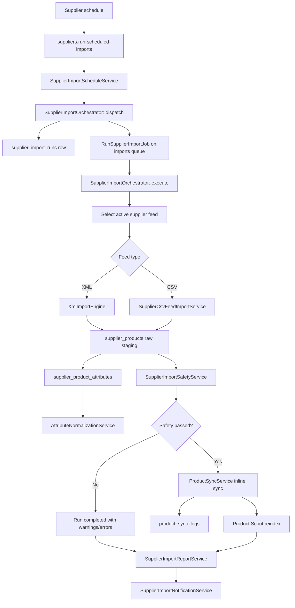

# Supplier Import Backend Audit

Generated: 2026-06-14

This report audits the current backend supplier import flow for `mycomputer.bg` v2. It documents only what exists in the codebase and does not propose or include business-logic changes.

## Executive Summary

The supplier import foundation is broad and mostly wired: suppliers, feeds, XML mappings, raw supplier product staging, import jobs, failed rows, import histories, supplier import runs, availability mappings, attribute normalization, product sync logs, and search reindex hooks all exist.

The current implementation is suitable for controlled staging validation, but it is not yet production-safe for unattended multi-supplier imports. The highest-risk gaps are:

- Partial row failures can mark a supplier feed as `failed`, which can prevent future scheduled imports because the scheduler selects only active feeds.
- Supplier products are not directly linked to `supplier_import_runs` or `import_jobs`, making run-level reporting, rollback, replay, and debugging fragile.
- Product sync and search reindexing are executed inline during import orchestration instead of being fully isolated into queue stages.
- Recurring supplier imports can create duplicate raw supplier rows, and duplicate detection may cause newer supplier data to be skipped instead of updating products.
- Both the newer scheduled supplier import command and the older due-feed sync command are scheduled, creating a possible double-import path.

## Current Flow

## Component Audit

### Suppliers

Implemented:

- `suppliers` table and `App\Models\Supplier`.
- Core fields for company/contact/status.
- Supplier priority and sync strategy fields.
- Scheduling fields:
  - `import_enabled`
  - `schedule_enabled`
  - `schedule_type`
  - `morning_import_time`
  - `evening_import_time`
  - `timezone`
  - `stagger_minutes`
  - `last_import_at`
  - `next_import_at`
  - `maximum_product_drop_percent`
  - `minimum_product_count`
  - `allow_destructive_sync`
  - `last_import_notification_at`
- Relationships to feeds, supplier products, XML templates, import jobs, offers, supplier attributes, and import runs.
- Filament supplier schedule controls.
- Seeded launch suppliers with staggered Europe/Sofia schedules:
  - ASBIS: 06:00 / 19:00
  - ALSO: 06:20 / 19:20
  - PolyComp: 06:40 / 19:40
  - APCOM: 07:00 / 20:00
  - Most: 07:20 / 20:20
  - Decada: 07:40 / 20:40

Incomplete:

- No per-supplier operational notification recipient list.
- No explicit import concurrency policy per supplier beyond cache locks.
- No supplier-level health score or last successful feed metrics.

Production risks:

- The lock mechanism depends on the configured cache driver. Redis is required for reliable multi-worker production locking.
- Force import can release a supplier lock, which can be dangerous if a worker is truly still processing.

### Supplier Feeds

Implemented:

- `supplier_feeds` table and `App\Models\SupplierFeed`.
- Supports `xml`, `csv`, and `api` as feed types.
- Fields for feed URL, encrypted credentials, update interval, mapping, last sync timestamp, last error, and status.
- Active feed selection in `SupplierImportOrchestrator`.
- XML feeds use `XmlImportEngine`.
- CSV feeds use `SupplierCsvFeedImportService`.
- Feed URLs go through SSRF protection.

Incomplete:

- API feeds are structurally represented but not executable.
- Scheduled CSV import supports a product-like mapping flow, not dedicated price-only, stock-only, or attribute-only supplier feed modes.
- No feed schema versioning.
- No unique constraints for duplicate feed definitions.
- No separate feed health/history table.

Production risks:

- XML and CSV import services can set a feed status to `failed` after row-level failures. The orchestrator selects only active feeds, so a mostly successful import with a few bad rows can disable future scheduled imports.
- Active feed selection prefers XML before CSV but does not handle multiple active feeds with explicit priority.

### Supplier Products

Implemented:

- `supplier_products` table and `App\Models\SupplierProduct`.
- Stores raw supplier data without directly updating catalog products.
- Supports supplier/feed/product references.
- Stores supplier identifiers:
  - `supplier_sku`
  - `supplier_ean`
  - `supplier_mpn`
- Stores supplier-provided name, brand, category, price, quantity, currency, raw data, payload hash, received timestamp, sync status, and mapping notes.
- Availability-related fields are present.
- Full history is preserved by inserting staging rows rather than updating products directly.

Incomplete:

- No direct `supplier_import_run_id`.
- No direct `import_job_id`.
- No run sequence, feed version, or import batch identifier.
- No raw row checksum uniqueness policy.
- No retention/archival strategy for raw feed payload history.

Production risks:

- Run reporting currently infers imported rows by timestamp ranges. This is fragile under overlapping runs, retries, clock drift, or long-running imports.
- Recurring imports can create many staging rows for the same supplier SKU/EAN/MPN. Product sync duplicate detection can then skip newer rows because older synced rows exist with the same identifiers.
- Raw payload growth can become expensive without retention, partitioning, or archival.

### Import Jobs

Implemented:

- `import_jobs` table and `App\Models\ImportJob`.
- Tracks supplier, feed, XML mapping template, type, mode, status, totals, preview data, timestamps, and error message.
- XML preview and queue actions exist in Filament.
- Scheduled imports create an import job before processing.

Incomplete:

- Import jobs are not directly connected to supplier import runs.
- CSV scheduled import creates a regular `ImportJob`, but the broader CSV Center job tables are separate.
- No standard import stage model for download, parse, validate, stage, sync, index, and report.

Production risks:

- Import job status and supplier import run status can diverge.
- Operators must correlate run, job, supplier products, failed rows, and sync logs indirectly.

### Import History

Implemented:

- `import_histories` table and `App\Models\ImportHistory`.
- `XmlImportEngine` and CSV importer write import events and context.

Incomplete:

- Histories link to import jobs but not supplier import runs.
- No consistent event taxonomy for all import phases.
- No per-stage durations.

Production risks:

- Debugging a supplier run requires joining by import job and timestamps rather than a single run identifier.

### Failed Imports

Implemented:

- `failed_imports` table and `App\Models\FailedImport`.
- Stores row number, error type, error message, supplier SKU, raw data, supplier, feed, and import job references.
- XML and CSV importers store failed row data.

Incomplete:

- No retry-from-failed-rows workflow.
- No failed-row export tied to supplier import runs.
- No severity classification.
- No automatic grouping of repeated supplier data issues.

Production risks:

- Large feed failures can create many records and need cleanup/retention.
- A small number of failed rows can mark the feed itself failed, creating scheduling risk.

### Supplier Import Runs

Implemented:

- `supplier_import_runs` table and `App\Models\SupplierImportRun`.
- Tracks supplier, feed, import job, trigger, status, started/finished timestamps, counters, warnings, errors, and report.
- `RunSupplierImportJob` dispatches and processes runs on the `imports` queue.
- `SupplierImportRunResource` provides Filament visibility.
- Admin API endpoints exist for listing runs and manually starting/force-starting imports.
- Dashboard stats widget exists.

Incomplete:

- No retry API endpoint is registered.
- No direct destroy route is registered even though controller has a `destroy` method.
- No run-level link from every staged supplier product.
- No run-level link from product sync logs.
- No explicit run cancellation.

Production risks:

- API resource returns `products_needing_review`, but the model/database field is `products_needs_review`. This can expose wrong or null metrics.
- Run metrics are partially inferred and can be inaccurate.
- Force-run behavior can bypass overlap protection if misused.

### XML Mapping Templates

Implemented:

- `xml_mapping_templates` table and `App\Models\XmlMappingTemplate`.
- Supports supplier-specific or reusable templates.
- Stores root path, field map, validation rules, defaults, and active state.
- XML import uses root XPath and mapped fields.
- XML import preview exists.

Incomplete:

- Validation rule support is basic.
- No visual mapper versioning or promotion workflow.
- No template compatibility check against a live feed before scheduling.
- No robust support for deeply nested variant/product structures beyond configured paths and extraction.

Production risks:

- Mapping mistakes can create large volumes of staged invalid data or failed rows.
- Feed status can be marked failed due to row-level mapping issues.

### Product Sync Logs

Implemented:

- `product_sync_logs` table and `App\Models\ProductSyncLog`.
- `ProductSyncService` logs action, status, match type, strategy, before/after values, and context.
- Supplier import orchestration calls `ProductSyncService` after successful safety checks.

Incomplete:

- Product sync currently runs inline inside the supplier import job.
- `SyncProductJob` exists but is not used by the supplier import orchestration flow.
- Logs are linked to supplier products and products, but not supplier import runs.
- No conflict dashboard dedicated to supplier import sync outcomes.

Production risks:

- Inline sync can make imports slow and more failure-prone for large feeds.
- A sync failure can affect the import run lifecycle.
- A no-op count query exists in the orchestrator and does not contribute to reporting.

### Availability Mappings

Implemented:

- Availability status and mapping tables exist.
- `AvailabilityStatusMapper` maps external statuses by source type/source code and has quantity fallback behavior.
- Supplier products and products have availability-related fields.
- Availability mappings are surfaced in admin resources.

Incomplete:

- Missing availability mapping review workflow for unmapped supplier statuses.
- No supplier-specific launch readiness report for all feed status codes.
- No destructive stock policy per availability status beyond safety checks.

Production risks:

- Unknown supplier availability values can fall back to quantity behavior and may misrepresent product availability.
- Product sync can update quantity/status after import safety passes, but stock reservation/checkout constraints should still be verified in staging.

### Attribute Normalization

Implemented:

- Canonical attribute tables exist:
  - `canonical_attributes`
  - `attribute_aliases`
  - `canonical_attribute_values`
  - `attribute_value_aliases`
  - `supplier_product_attributes`
  - `attribute_mapping_logs`
  - `category_attribute_templates`
- Services exist for name mapping, value normalization, unit conversion, supplier extraction, catalog writing, duplicate detection, and review queue behavior.
- XML imports stage supplier attributes.
- CSV imports can stage attributes from mapped rows.
- Product sync writes canonical attributes into catalog products.
- Admin resources exist for canonical attributes, aliases, values, supplier attributes, and mapping logs.

Incomplete:

- Low-confidence/unmapped attributes require manual review and are not automatically resolved.
- Scheduled supplier CSV import does not cover every possible attribute feed shape.
- Attribute governance workflow is still dependent on admin review quality.

Production risks:

- Real supplier feeds can still produce unmapped aliases and values at scale.
- Without preloading supplier-specific aliases, filters can be incomplete until review is performed.

### Search Indexing

Implemented:

- `Product` is searchable through Laravel Scout.
- Public search indexes product-safe fields and excludes purchase price, credentials, raw XML, and source payload.
- Product searchable arrays include brand, category, category path, availability, stock, pricing, flags, and canonical attributes.
- Supplier import orchestration calls `searchable()` on affected active products after sync.
- Search abstraction exists for Meilisearch/database fallback.

Incomplete:

- Supplier import orchestration does not dispatch a dedicated search indexing job.
- Reindexing is tied to affected product IDs inferred from supplier products imported after the run start time.
- No import-run-specific search indexing status.

Production risks:

- If Scout queueing is disabled, indexing can run inline and slow import jobs.
- If affected product IDs are inferred incorrectly, search can miss updated products.
- Failed or skipped product sync can leave search stale until a full reindex.

## Scheduling And Queue Audit

Implemented:

- `suppliers:run-scheduled-imports` command exists.
- Due suppliers are selected by schedule fields and current time.
- Disabled suppliers and non-due suppliers are skipped.
- Overlapping imports are skipped unless forced.
- `RunSupplierImportJob` uses the `imports` queue with retries, timeout, backoff, and a failed handler.
- `GenerateSupplierImportReportJob` exists.
- `ProcessSupplierImportRunJob` exists as a compatibility wrapper.

Incomplete:

- Product sync and search indexing are not separated into their own queue pipeline during supplier import.
- No run cancellation or pause mechanism.
- No queue-level import priority per supplier.
- No backpressure strategy for simultaneous large suppliers.

Production risks:

- `routes/console.php` schedules both `suppliers:run-scheduled-imports` and the older `suppliers:sync-due-feeds`. This can create duplicate import paths if both commands remain enabled in production.
- Import jobs can take a long time because download, parse, stage, safety, sync, indexing, reporting, and notification are all coordinated in one execution path.

## Admin And API Audit

Implemented:

- Supplier schedule controls in Filament.
- Manual Run Import and Force Import actions in the supplier table.
- Supplier Import Run resource.
- Supplier Import Stats widget.
- Admin API routes for import run listing and manual/force run.
- Permission checks for supplier import viewing/running/force running.

Incomplete:

- Retry Import action is not fully exposed.
- Suppression/cooldown configuration is not visible enough for operators.
- Import run detail is edit-page-as-view rather than a purpose-built operational page.
- No dedicated dashboard for mapping gaps grouped by supplier feed.

Production risks:

- Operators may force-run imports without fully understanding lock/safety implications.
- Missing retry UI/API can encourage force runs instead of controlled retries.

## What Is Implemented

- Supplier and feed data model.
- Raw supplier product staging.
- XML import with mapping templates and preview.
- CSV supplier feed import service.
- Failed row logging.
- Import history logging.
- Supplier import run tracking.
- Scheduled staggered import support for six launch suppliers.
- Import safety checks for empty feeds and mass product drops.
- Product sync from supplier products into catalog products.
- Product sync logging.
- Attribute normalization pipeline.
- Availability status mapping.
- Search indexing hook after product sync.
- Filament resources and widgets for most operational areas.
- Admin API endpoints for run/list/manual import actions.

## What Is Incomplete

- Direct foreign key linkage from staged rows, sync logs, failed rows, and histories to supplier import runs.
- Fully queued import pipeline stages.
- Retry flow for import runs.
- API feed execution.
- Rich validation and versioning for XML templates.
- Production-grade notification routing.
- Feed failure semantics that distinguish row-level data problems from feed-level operational failures.
- Import retention and cleanup policies.
- Supplier-specific readiness checks before enabling real feeds.
- Explicit search indexing job/status per import run.

## What Breaks Or Can Break In Production

### Critical

1. **Partial import failures can disable future imports**

   XML and CSV importers can mark `supplier_feeds.status` as `failed` when row-level failures occur. The scheduled orchestrator selects only active feeds, so the next scheduled import may not run.

2. **Recurring imports can skip fresh supplier updates**

   Supplier products are inserted as history. Product sync duplicate detection checks existing supplier products with the same identifiers, including previously synced rows. New rows from recurring imports can be marked duplicate and skipped instead of updating prices and stock.

3. **Dual scheduling paths can trigger duplicate imports**

   Both the newer `suppliers:run-scheduled-imports` and older `suppliers:sync-due-feeds` are scheduled. This can cause duplicate import behavior unless one path is explicitly disabled.

### High

4. **Run-level traceability is incomplete**

   `supplier_products`, `failed_imports`, `import_histories`, and `product_sync_logs` do not consistently link to `supplier_import_runs`. Production debugging and reconciliation will be fragile.

5. **Sync and search are too inline**

   Product sync and search indexing are executed from the import orchestration flow. Large feeds can hit timeouts, memory pressure, or partial completion risks.

6. **Distributed locking depends on Redis**

   Import overlap protection relies on cache locks. File/database cache locks are not enough for a production multi-container queue setup.

7. **Force import can break overlap safety**

   Force import releases an existing lock. If an old worker is still running, this can allow concurrent processing.

### Medium

8. **Incorrect API metric field**

   `SupplierImportRunResource` exposes `products_needing_review`, while the persisted field is `products_needs_review`.

9. **Notification routing is weak**

   Import alerts appear to target the mail from-address/support fallback rather than configured operations recipients.

10. **Safety counters can be misleading**

   `products_seen` is based on processed rows, not necessarily total feed rows. Feeds with many validation failures can look like product drops.

11. **Temporary feed files lack cleanup policy**

   Downloaded CSV files are stored under imports but no clear cleanup/retention policy is visible.

12. **No run retry endpoint**

   Manual and force-run actions exist, but a controlled retry of failed runs is not fully exposed.

### Low

13. **Unused sync log count query**

   A `ProductSyncLog` count is executed in the orchestrator without being used.

14. **Operational pages are functional but not optimized**

   Some Filament run pages behave as disabled edit pages rather than dedicated run-detail dashboards.

## Recommended Next 10 Implementation Tasks

1. **Fix feed failure semantics**

   Separate feed operational status from row-level import outcome. A feed should not become unavailable for future scheduled imports just because some rows failed validation.

2. **Add run linkage to staged data**

   Add `supplier_import_run_id` to `supplier_products`, `failed_imports`, `import_histories`, and `product_sync_logs` where appropriate. Use this as the primary reporting and reconciliation key.

3. **Fix recurring supplier product deduplication**

   Redesign duplicate handling so repeated imports update latest supplier offers instead of skipping fresh supplier rows because older synced rows exist.

4. **Disable or consolidate duplicate scheduler paths**

   Choose one production scheduler command. Retire or explicitly disable the old `suppliers:sync-due-feeds` path for launch.

5. **Move product sync to queued run stages**

   Dispatch supplier product sync work through dedicated sync jobs and record sync stage status on the supplier import run.

6. **Move search indexing to explicit queue jobs**

   Queue affected product reindexing after sync completion and record indexing status/failures.

7. **Harden import locking and force-run behavior**

   Require Redis locks in production, add stale-lock detection, and make force-run behavior safer for active workers.

8. **Fix run metrics and API field mismatch**

   Correct `products_needing_review` vs `products_needs_review`, define metric names consistently, and calculate counters from run-linked records.

9. **Add production notification routing**

   Add configurable supplier import alert recipients, severity levels, cooldown settings, and notification audit records.

10. **Create supplier launch readiness checks**

   Add a command/report that validates each launch supplier feed, mapping template, availability mappings, attribute aliases, safety thresholds, and expected product counts before enabling scheduling.

## Staging Validation Checklist

Before enabling real supplier imports:

- Confirm Redis is used for cache locks and queues.
- Disable the legacy due-feed scheduler or confirm it cannot process the same suppliers.
- Run one supplier manually with a small feed and verify:
  - import run status
  - import job status
  - supplier products staged
  - supplier attributes staged
  - failed rows recorded
  - product sync logs created
  - products updated or created as expected
  - search index updated
- Run the same supplier feed twice and verify price/quantity updates are not skipped as duplicates.
- Test a feed with a few invalid rows and verify future scheduled imports remain enabled.
- Test an empty feed and verify no products are marked out of stock.
- Test a massive product drop and verify destructive sync is blocked.
- Confirm supplier import notifications go to the intended operations recipients.
- Confirm Filament import run metrics match database counts.
- Confirm active products remain searchable after sync.

## Production Readiness Verdict

Supplier import is **partially implemented** and has a strong architectural foundation, but it is **not production-ready for unattended launch supplier automation**.

It can be used in controlled staging and manual validation. Before production scheduling is enabled, the critical issues around feed status semantics, recurring import deduplication, run linkage, duplicate scheduler paths, and queued sync/index stages should be resolved.
