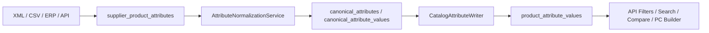

# Product Attribute Normalization

The Product Attribute Normalization & Mapping Engine prevents supplier feeds from creating duplicate catalog filters such as `RAM`, `Memory` and `Оперативна памет`, or duplicate values such as `16GB`, `16 GB` and `16384 MB`.

## Core Rule

Supplier, XML, CSV, ERP and API attributes are staged first. They do not become public catalog filters until they are mapped to canonical attributes and values.

## Tables

- `canonical_attributes`: canonical definitions such as `ram`, `cpu_socket`, `memory_type`, `psu_wattage`.
- `attribute_aliases`: name aliases such as `Memory`, `RAM`, `Оперативна памет`.
- `canonical_attribute_values`: canonical values such as `16 GB`, `DDR5`, `AM5`.
- `attribute_value_aliases`: value aliases such as `16GB`, `16384 MB`, `DDR 5`.
- `supplier_product_attributes`: raw staged supplier attributes with mapping status.
- `attribute_mapping_logs`: mapping history and confidence scores.
- `category_attribute_templates`: expected canonical attributes per category.
- `product_attribute_values.canonical_attribute_id`: canonical catalog assignment.
- `product_attribute_values.canonical_attribute_value_id`: canonical catalog value.

## Services

- `AttributeTextNormalizer`: normalizes names and text aliases.
- `UnitConversionService`: converts common capacity, power and frequency units.
- `AttributeNameMapper`: maps raw names to canonical attributes.
- `AttributeValueNormalizer`: maps raw values to canonical values.
- `AttributeNormalizationService`: stages, normalizes, sets status and logs results.
- `SupplierAttributeExtractionService`: extracts repeated attributes from XML/raw payload arrays.
- `AttributeMappingReviewService`: admin approval and alias creation.
- `DuplicateAttributeDetectionService`: finds likely duplicate canonical definitions.
- `CatalogAttributeWriter`: writes approved canonical assignments into catalog tables.

## Statuses

- `mapped`: confident canonical attribute and value were found.
- `needs_review`: raw name or value needs admin approval.
- `unmapped`: raw row has not been normalized yet.
- `ignored`: admin intentionally excluded this attribute.

Rows below confidence threshold stay in staging and do not pollute public filters.

## Import Integration

XML imports store products in `supplier_products` and stage repeated XML attributes in `supplier_product_attributes`.

CSV attribute imports stage and normalize attribute rows. Mapped rows are written to catalog attributes. Rows needing review are recorded as CSV failures while the raw staged attribute remains available for admin mapping.

Product Sync extracts attributes from `supplier_products.raw_data.attributes`, `specifications` or `specs` when no staged attributes exist. Only mapped staged attributes are written into `product_attribute_values`.

## Search, Filters And Comparison

Public filters and search use canonical codes and normalized value slugs:

- attribute code: `ram`
- value slug: `16_gb`
- numeric facet: `ram_gb = 16`

Product API resources expose canonical metadata for each attribute assignment. Compare and PC Builder compatibility prefer canonical codes and fall back to legacy attribute slugs only for older data.

## Filament Admin

Attribute Normalization admin includes:

- Canonical Attributes
- Canonical Values
- Attribute Aliases
- Value Aliases
- Supplier Attribute Staging
- Mapping Logs
- Unmapped Attributes
- Duplicate Attribute Report

All pages require the `manage attribute mappings` permission.

## Operational Checklist

Before enabling a new supplier:

- Import a preview feed.
- Review `Supplier Attribute Staging` for `needs_review` rows.
- Approve aliases for common names and values.
- Check `Duplicate Attribute Report`.
- Run product sync only after high-value filter attributes are mapped.
- Reindex search with `php artisan search:reindex`.

## Examples

The following raw names should map to canonical `ram`:

- `RAM`
- `Memory`
- `Оперативна памет`

The following raw values should map to canonical `16 GB`:

- `16GB`
- `16 GB`
- `16384 MB`
- `16 гб`
