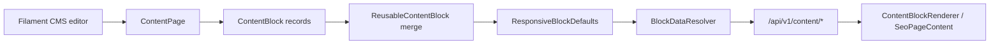

# Content Blocks CMS Builder

The Content Blocks CMS Builder extends the responsive SEO page builder into a reusable landing-page and campaign-page system.

It is designed for homepage layouts, brand pages, category pages, campaigns, B2B pages, service pages and custom landing pages without requiring developers to create separate pages per device.

## Core Models

- `ContentPage`: public or scheduled CMS page with SEO metadata and ordered blocks.
- `ContentBlock`: page-level block configuration, content, visibility rules and responsive settings.
- `ContentTemplate`: reusable starter page layouts for editors.
- `ReusableContentBlock`: shared block definitions that can be reused and locally overridden.

## Responsive System

The CMS reuses `App\Support\Content\ResponsiveBlockDefaults`.

Supported device profiles:

- Desktop: `1200px+`
- Tablet: `768px-1199px`
- Mobile: `<768px`

Every block can store:

- per-device visibility
- layout width, max width, columns, spacing and alignment
- typography sizes
- button layout and alignment
- padding and margin
- hero/banner height
- carousel slides per view
- media ordering
- desktop, tablet and mobile images

Image fallback order is mobile to tablet to desktop. The Nuxt renderer must avoid loading hidden device images when responsive picture sources are available.

Blocks hidden on desktop, tablet and mobile are removed by the backend renderer and are not included in public API payloads. Blocks hidden on only one or two device profiles still use responsive CSS because SSR cannot know the final viewport.

## Block Registry

`App\Services\Content\BlockRegistry` is the source of truth for available block types. It groups blocks by domain:

- layout
- marketing
- commerce
- bundles
- categories
- brands
- trust
- b2b
- tech_store
- content

New block types should be added to the registry before they are exposed in Filament or rendered in Nuxt.

## Rendering Flow

`ContentPageService` loads published pages, `BlockRenderer` normalizes every block and `BlockDataResolver` attaches catalog data for product, category, brand and bundle blocks.

`CmsHtmlSanitizer` cleans rich HTML fields before API output for `rich_text`, `image_text` and `custom_html` blocks. It removes script/style/embed-style tags, strips unsafe event attributes such as `onclick` and blocks unsafe URL protocols such as `javascript:`.

## Public API

- `GET /api/v1/content/homepage`
- `GET /api/v1/content/pages/{slug}`
- `GET /api/v1/content/templates`
- `GET /api/v1/content/block-types`

Only `published` pages with `published_at <= now()` are public.

FAQ blocks generate a `schema` payload using schema.org `FAQPage` format. The schema is built only from visible blocks.

## Filament Admin

Resources:

- `ContentPageResource`
- `ContentTemplateResource`
- `ReusableContentBlockResource`

Permissions:

- `manage content pages`
- `publish content pages`
- `manage templates`
- `manage reusable blocks`

Current authorization uses the manage permissions for resource access. Granular publish workflows can be added later with the seeded `publish content pages` permission.

## Frontend

Nuxt uses:

- `useContent()`
- `ContentBlockRenderer`
- `SeoPageContent`

The homepage first attempts `GET /api/v1/content/homepage` and falls back to the existing `/home` API when no CMS homepage exists.

Public CMS pages are available in Nuxt at `/content/{slug}`. The legacy `/pages/{slug}` route remains backed by the older SEO page API for backward compatibility.

## Analytics

`BlockAnalyticsService` provides backend hooks for page and block analytics. Frontend click/view tracking can emit marketing events through the existing analytics layer.

## Production Notes

- Keep legacy SEO page HTML support intact.
- Do not expose drafts, archived pages or scheduled pages before `published_at`.
- Validate JSON block payloads carefully in editorial workflows.
- Keep `custom_html` available only to admin users.
- Run browser QA on desktop, tablet and mobile before publishing high-traffic campaigns.
- Use staging to verify responsive image loading and block visibility before launch.
